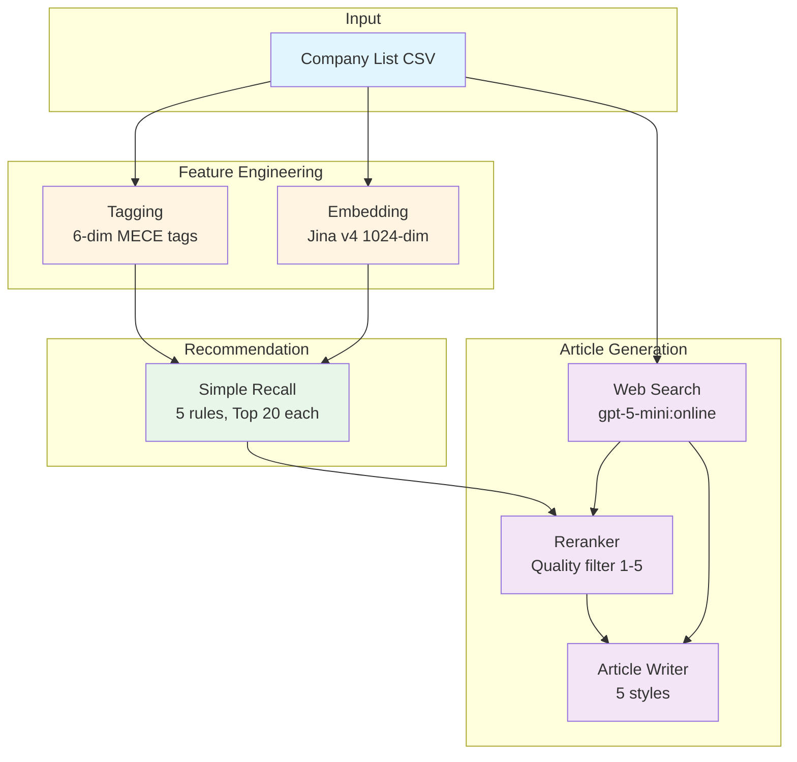

# AIHireBox Company-Side Agentic Recsys

> AI-powered company recommendation and multi-style article generation pipeline.
>
> [English Version](./README_EN.md)

## Overview

This system provides:
1. **Feature Engineering** - LLM-based company tagging + Jina Embeddings (1024-dim)
2. **Recommendation Engine** - Multi-dimensional similarity with head suppression
3. **Article Generation** - Web search + LLM reranking + multi-style articles

## Prerequisites

- Python 3.10+
- API Keys:
  - `OPENROUTER_API_KEY` (required, optional fallback: `OPENROUTER_FALLBACK_API_KEY`)
  - `JINA_API_KEY` (required, for embeddings)

## Installation

```bash
# Using uv (recommended)
uv venv && source .venv/bin/activate && uv pip install -r requirements.txt

# Or using pip
python -m venv .venv && source .venv/bin/activate && pip install -r requirements.txt

# Configure API keys
cp .env.example .env
# Edit .env with your API keys
```

## Quick Start

### Run Full Pipeline

```bash
# Run complete 6-stage pipeline (tagging → embedding → recall → web search → rerank → articles)
./run_full_pipeline.sh

# Use custom input/output
./run_full_pipeline.sh --input data/aihirebox_company_list_sample.csv --output output_sample

# Use custom model (applies to tagging, reranker, and article writer)
./run_full_pipeline.sh --model openai/gpt-oss-120b

# Adjust concurrency (default: 20 workers)
./run_full_pipeline.sh --concurrency 30

# Skip article generation (only stages 1-3)
./run_full_pipeline.sh --skip-articles

# Incremental mode (only process new companies)
./run_full_pipeline.sh --incremental

# Sync outputs to Tencent Cloud COS
./run_full_pipeline.sh --sync-cos

# Show help
./run_full_pipeline.sh --help
```

### E2E Testing

```bash
# Run E2E tests with sample data (20 companies, lower cost)
./run_e2e_test.sh

# Skip LLM-dependent tests (only test module imports)
./run_e2e_test.sh --skip-llm

# Clean test output and run fresh
./run_e2e_test.sh --clean
```

Test output is saved to `output_test/` (separate from production data).

### Individual Commands

| Stage | Command | Description |
|-------|---------|-------------|
| 1. Tagging | `python run_tagging.py data/aihirebox_company_list.csv` | Extract 6-dim MECE tags |
| 2. Embedding | `python run_embedding.py data/aihirebox_company_list.csv` | Generate Jina embeddings |
| 3. Recall | `python run_simple_recommender.py --all` | 5-rule recall system |
| 4. Web Search | `python run_web_search_cache.py --company-csv data/...` | Cache web search results |
| 5. Rerank | `python run_reranker.py --recall-results ...` | LLM quality filter (1-5 per rule) |
| 6. Articles | `python run_article_writer.py --rerank-dir ...` | Multi-style article generation |

## Pipeline Overview



## Output Structure

**All outputs must be under `outputs/` directory** (never in project root):

```
outputs/
├── production/           # Default production runs
│   ├── company_tagging/
│   ├── company_embedding/
│   ├── simple_recall/
│   └── article_generator/
│       ├── rerank_cache/
│       └── articles/
├── test/                 # Test mode runs (--test flag)
└── {custom}/             # Custom runs (--output outputs/custom)

cache/
└── web_search/           # Persistent web search cache (shared)
```

## Project Structure

```
aihirebox-company-recsys/
├── core/                   # Shared utilities (models, data I/O, constants)
├── company_tagging.py      # LLM-based tag extraction
├── company_embedding.py    # Jina Embeddings v4
├── company_recommender.py  # Multi-dimensional recommender
├── simple_recommender.py   # 5-rule recall system
├── article_generator/      # Article generation subpackage
│   ├── web_searcher.py
│   ├── reranker.py
│   ├── article_writer.py
│   └── styles.py
├── run_*.py                # CLI wrappers
├── api/                    # FastAPI server
└── data/                   # Input CSV files
```

## Key Technical Details

- **Scoring Formula**: 60% tag Jaccard + 40% embedding cosine similarity
- **Head Suppression**: 60% penalty for public/bigtech companies
- **5 Recall Rules**: R1 (industry), R2 (tech_focus), R3 (industry+market), R4 (team), R5 (industry+team)
- **Reranker**: Quality filter selecting 1-5 companies per rule (宁缺毋滥 - quality over quantity)
- **Concurrency**: Default 20 parallel workers for web search, reranker, and article generation
- **Article Styles**: **36kr (recommended)** - fact-based, web-search grounded. Other styles experimental (see `docs/xiaohongshu_style_retrospective.md`)

## API Server

```bash
# Development
uvicorn api.main:app --reload

# Docker
docker-compose up --build
```

## Documentation

For detailed documentation, see:

- [Full Pipeline Guide](docs/README_FULL.md) - Complete scenarios and commands
- [CLAUDE.md](CLAUDE.md) - Developer guide for AI assistants
- [Manual Candidate Selection](docs/manual_candidate_selection.md) - How to manually specify candidates for article generation
- [Xiaohongshu Style Retrospective](docs/xiaohongshu_style_retrospective.md) - Why "真人视角" LLM generation doesn't work

## Troubleshooting

### Validate Production Outputs
After running the pipeline, check for failed tagging or missing articles:
```bash
python scripts/validate_production.py
```

### Fix Failed Companies
When validation finds issues, use the incremental fix script:
```bash
# Fix specific companies (command shown in validation output)
python scripts/fix_companies.py --company-ids cid_123 cid_124

# Dry run to see what would be executed
python scripts/fix_companies.py --company-ids cid_123 --dry-run
```

See [CLAUDE.md](CLAUDE.md) for detailed troubleshooting commands.

## Git Workflow

**IMPORTANT**: Always create a new feature branch for commits. Never commit directly to `main` or `master`.

```bash
# Create a new branch for your changes
git checkout -b feature/your-feature-name

# After making changes, commit and push
git add .
git commit -m "Your commit message"
git push -u origin feature/your-feature-name

# Create a PR via GitHub CLI
gh pr create --title "Your PR title" --body "Description"
```

## Architecture Improvements

The codebase uses a `core/` module for shared utilities:

```python
from core import (
    CompanyRecord,       # Raw company data from CSV
    CompanyProfile,      # Company with MECE tags
    load_companies_from_csv,
    load_embeddings_npy,
    load_company_profiles,
    HEAD_COMPANY_STAGES,
    DIMENSION_LABELS,
)
```

This reduces code duplication and improves maintainability.

## License

[Your License Here]
