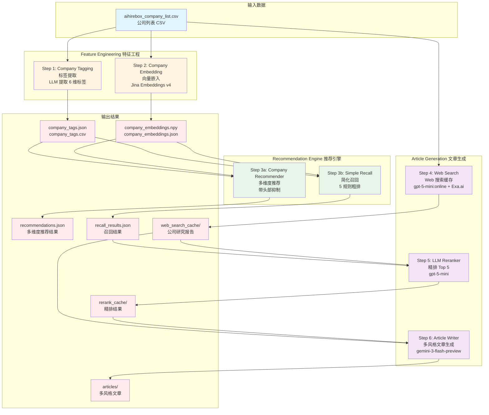
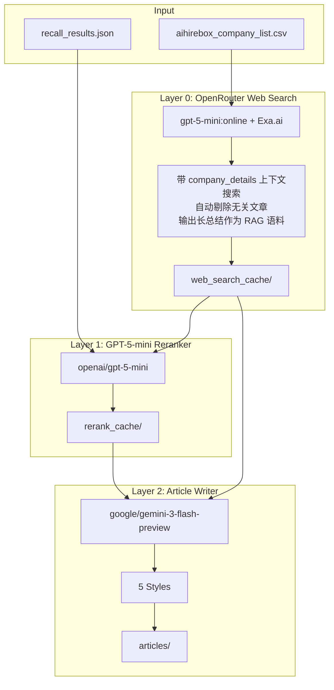

# AIHireBox Company Side Agentic Recsys

> [English Version](./README_EN.md)

该项目构造AI职小盒旗下智能体公司咨询推荐模块，部分代码和文档由Claude Code/Codex等copilot agent修正、生成。

核心模块为这三点

1. **Feature Engineering** - LLM-based company tagging and Jina Embeddings for semantic representation
2. **Recommendation Engine** - Multi-dimensional company recommendation with head suppression
3. **Article Generation** - LLM-powered reranking and multi-style article writing via OpenRouter

## Prerequisites

- Python 3.10+
- API keys for:
  - OpenRouter (primary `OPENROUTER_API_KEY`; optional fallback `OPENROUTER_FALLBACK_API_KEY`)
  - Jina AI Embeddings (`JINA_API_KEY`) - for company embeddings

Copy `.env.example` to `.env` and fill in your keys:

```bash
cp .env.example .env
```

## Installation

### Using uv (Recommended)

[uv](https://github.com/astral-sh/uv) is a fast Python package installer and resolver.

```bash
# Install uv (if not already installed)
curl -LsSf https://astral.sh/uv/install.sh | sh

# Create virtual environment
uv venv

# Activate virtual environment
source .venv/bin/activate  # macOS/Linux
# or
.venv\Scripts\activate     # Windows

# Install dependencies
uv pip install -r requirements.txt
```

### Using pip

```bash
# Create virtual environment
python -m venv .venv

# Activate virtual environment
source .venv/bin/activate  # macOS/Linux
# or
.venv\Scripts\activate     # Windows

# Install dependencies
pip install -r requirements.txt
```

## 数据目录结构

所有生产数据统一存放在 `output_production/` 目录，按模块分子文件夹组织，便于容器化部署：

```
output_production/
├── company_tagging/            # 公司标签模块
│   ├── company_tags.json       # 公司标签 (LLM 生成)
│   ├── company_tags.csv        # 标签 CSV 格式
│   └── run_metadata.json       # 运行元数据
├── company_embedding/          # 向量嵌入模块
│   ├── company_embeddings.npy  # 向量嵌入 (Jina Embeddings)
│   ├── company_embeddings.mapping.json
│   ├── company_embeddings.json
│   ├── company_embeddings.csv
│   └── run_metadata.json
├── recommender/                # 推荐模块
│   ├── recommendations.json    # 推荐结果
│   └── run_metadata.json
├── simple_recall/              # 简化召回模块
│   ├── recall_results.json     # 召回结果
│   └── run_metadata.json
└── article_generator/          # 文章生成模块
    ├── web_search_cache/       # Web 搜索缓存
    ├── rerank_cache/           # LLM 精排缓存
    └── articles/               # 生成的文章
        ├── index.json          # 文章索引（按公司分组）
        ├── json/               # JSON 格式
        └── markdown/           # Markdown 格式
```

**容器化挂载**：只需挂载两个目录：
- `data/` - 源数据 CSV
- `output_production/` - 所有生产数据

## 项目流程图



**流程说明**：
1. **特征工程阶段**：从 CSV 提取标签和生成向量嵌入
2. **推荐引擎阶段**：基于标签和向量进行推荐（多维度推荐或简化召回）
3. **文章生成阶段**：Web 搜索 → LLM 精排 → 多风格文章生成（可选流程）

---

# Production Pipeline

以下是生产环境的完整工作流，包含 **标签提取 → 向量嵌入 → 公司召回 → 文章生成** 四个阶段。

> **注意**：所有生产数据默认输出到 `output_production/` 目录，详见 [数据目录结构](#数据目录结构)。详细参数说明见各模块的详细文档。

## Production Pipeline Summary

> 所有生产数据统一存放在 `output_production/` 目录（按模块分子文件夹），详见 [数据目录结构](#数据目录结构)。

### 文章生成输出结构

文章生成后的目录结构：

```
output_production/article_generator/articles/
├── index.json              # 详细索引（按公司分组，含所有文章元数据）
├── json/                   # JSON 格式文章
│   ├── cid_100_R1_industry_36kr.json
│   ├── cid_100_R2_tech_focus_36kr.json
│   └── ...
└── markdown/               # Markdown 格式文章
    ├── cid_100_R1_industry_36kr.md
    ├── cid_100_R2_tech_focus_36kr.md
    └── ...
```

`index.json` 包含每次生成的完整元数据，按公司分组索引所有文章。

---

### 场景 1: 全量更新（初次运行或防止 Data Drift）

**适用场景**：
- 首次初始化系统
- 定期全量更新（如每月/每季度）防止数据漂移
- 修复数据质量问题需要重新生成

#### 基础流程（标签提取 → 向量嵌入 → 召回）

```bash
# Step 1: 全量标签提取（覆盖已有数据）
python run_tagging.py data/aihirebox_company_list.csv \
    --model openai/gpt-5-mini:online --no-reasoning

# Step 2: 全量向量嵌入（覆盖已有数据）
python run_embedding.py data/aihirebox_company_list.csv

# Step 3: 全量召回（重新计算所有公司的推荐关系）
python run_simple_recommender.py --all \
    --output-dir output_production/simple_recall
```

#### 文章生成流程（可选）

```bash
# Step 4: Web Search 缓存（重新搜索所有公司，不加 --skip-existing）
python run_web_search_cache.py \
    --company-csv data/aihirebox_company_list.csv \
    --output-dir output_production/article_generator/web_search_cache

# Step 5: LLM 精排（重新精排所有结果，不加 --skip-existing）
python run_reranker.py \
    --recall-results output_production/simple_recall/recall_results.json \
    --web-cache-dir output_production/article_generator/web_search_cache \
    --output-dir output_production/article_generator/rerank_cache

# Step 6: 生成文章（并行模式，20 并发）
# 输出到 articles/json/ 和 articles/markdown/，生成 index.json
python run_article_writer.py \
    --rerank-dir output_production/article_generator/rerank_cache \
    --web-cache-dir output_production/article_generator/web_search_cache \
    --output-dir output_production/article_generator/articles \
    --concurrency 20 \
    --styles 36kr
```

---

### 场景 2: 增量更新（新公司加入）

**适用场景**：
- 有新公司加入数据库
- 需要更新新公司的标签、向量、召回和文章

**重要**：新公司加入后，**必须重新运行全量召回**，因为新公司可能影响现有公司的推荐关系。

#### 基础流程

```bash
# Step 1: 增量标签提取（只处理新公司，自动检测或指定）
# 方式 1: 自动检测新公司（推荐）
python run_tagging.py data/aihirebox_company_list.csv \
    --merge output_production/company_tagging \
    --model openai/gpt-5-mini:online --quiet --no-reasoning

# 方式 2: 指定新公司 ID
python run_tagging.py data/aihirebox_company_list.csv \
    --company-ids cid_new_1 cid_new_2 \
    --merge output_production/company_tagging \
    --model openai/gpt-5-mini:online --quiet --no-reasoning

# Step 2: 增量向量嵌入（只处理新公司）
python run_embedding.py data/aihirebox_company_list.csv \
    --merge output_production/company_embedding

# Step 3: 全量召回（重要：必须重新计算所有公司的推荐关系）
python run_simple_recommender.py --all \
    --output-dir output_production/simple_recall
```

#### 文章生成流程（增量）

```bash
# Step 4: Web Search 缓存（只搜索新公司）
python run_web_search_cache.py \
    --company-csv data/aihirebox_company_list.csv \
    --company-ids cid_new_1 cid_new_2 \
    --output-dir output_production/article_generator/web_search_cache

# Step 5: LLM 精排（只精排新公司的召回结果）
python run_reranker.py \
    --recall-results output_production/simple_recall/recall_results.json \
    --company-ids cid_new_1 cid_new_2 \
    --web-cache-dir output_production/article_generator/web_search_cache \
    --output-dir output_production/article_generator/rerank_cache

# Step 6: 生成文章（只生成新公司的文章，--skip-existing 跳过已有）
python run_article_writer.py \
    --rerank-dir output_production/article_generator/rerank_cache \
    --company-ids cid_new_1 cid_new_2 \
    --web-cache-dir output_production/article_generator/web_search_cache \
    --output-dir output_production/article_generator/articles \
    --concurrency 20 \
    --skip-existing \
    --styles 36kr
```

---

### 场景 3: 部分更新（仅更新 Web Search 缓存）

**适用场景**：
- 定期更新公司信息（如每月更新一次）
- 只需要刷新 Web Search 缓存，其他数据保持不变
- 成本优化：只更新需要更新的部分

#### 更新 Web Search 缓存

```bash
# 重新搜索所有公司（不加 --skip-existing 会覆盖已有缓存）
python run_web_search_cache.py \
    --company-csv data/aihirebox_company_list.csv \
    --output-dir output_production/article_generator/web_search_cache
```

**注意**：
- 此操作只更新 Web Search 缓存，不影响标签、向量、召回结果
- 如果需要基于新的 Web Search 结果重新生成文章，需要：
  1. 重新运行精排（使用新的 Web Search 缓存）
  2. 重新生成文章

#### 可选：基于新 Web Search 重新生成文章

```bash
# 重新精排（使用新的 Web Search 缓存，不加 --skip-existing）
python run_reranker.py \
    --recall-results output_production/simple_recall/recall_results.json \
    --web-cache-dir output_production/article_generator/web_search_cache \
    --output-dir output_production/article_generator/rerank_cache

# 重新生成文章（不加 --skip-existing）
python run_article_writer.py \
    --rerank-dir output_production/article_generator/rerank_cache \
    --web-cache-dir output_production/article_generator/web_search_cache \
    --output-dir output_production/article_generator/articles \
    --styles 36kr xiaohongshu
```

---

## 数据分析工具

使用 Jupyter Notebook 分析推荐结果质量：

```bash
jupyter lab analyze_recommendations.ipynb
```

分析内容包括：
- 📊 每公司推荐统计（维度数、推荐数、平均分数）
- 📈 相似度分数分布（final score / tag score / embedding score）
- 🏷️ 维度使用频率分析
- ⬇️ 头部抑制效果评估
- 🔄 互相推荐网络分析
- 🎯 质量评估总结与评级

### Dependencies

```
openai>=1.30.0
numpy>=1.24.0
python-dotenv>=1.0.1
requests>=2.32.0
tqdm>=4.66.0
```

---

# Feature Engineering

## Company Tagging (`company_tagging.py`)

Core module for extracting MECE (Mutually Exclusive, Collectively Exhaustive) tags from company details using LLM.

**[TAG_TAXONOMY](./company_tagging.py)** 由 anthropic/claude-opus-4.5 通过对[aihirebox_company_list.csv](./data/aihirebox_company_list.csv)取样直接生成。

### Tag Dimensions (6个维度)

| Dimension | 中文名 | Type | Options |
|-----------|--------|------|---------|
| **industry** | 行业领域 | Multi | `ai_llm`, `robotics`, `edtech`, `fintech`, `healthtech`, `enterprise_saas`, `ecommerce`, `gaming`, `social`, `semiconductor`, `automotive`, `consumer_hw`, `cloud_infra`, `content_media`, `biotech`, `investment`, `other` |
| **business_model** | 商业模式 | Multi | `b2b`, `b2c`, `b2b2c`, `platform`, `saas`, `hardware`, `marketplace`, `consulting` |
| **target_market** | 目标市场 | Multi | `china_domestic`, `global`, `sea`, `us`, `europe`, `japan_korea`, `latam`, `mena` |
| **company_stage** | 发展阶段 | Single | `seed`, `early`, `growth`, `pre_ipo`, `public`, `bigtech_subsidiary`, `profitable`, `unknown` |
| **tech_focus** | 技术方向 | Multi | `llm_foundation`, `computer_vision`, `speech_nlp`, `embodied_ai`, `aigc`, `3d_graphics`, `chip_hardware`, `data_infra`, `autonomous`, `blockchain`, `quantum`, `not_tech_focused` |
| **team_background** | 团队背景 | Multi | `bigtech_alumni`, `top_university`, `serial_entrepreneur`, `academic`, `industry_expert`, `international`, `unknown` |

### Basic Usage

```bash
# 全量处理（生产用，默认输出到 output_production/company_tagging/）
python run_tagging.py data/aihirebox_company_list.csv \
    --model openai/gpt-5-mini:online --quiet --no-reasoning

# 处理指定公司（支持 --company-ids 或 --company-ids-json）
python run_tagging.py data/aihirebox_company_list.csv \
    --company-ids cid_0 cid_1 --merge output_production/company_tagging

# 增量更新（自动检测新公司）
python run_tagging.py data/aihirebox_company_list.csv \
    --merge output_production/company_tagging \
    --model openai/gpt-5-mini:online --quiet --no-reasoning
```

### Checkpoint & Resume（断点续传）

脚本默认每处理 10 家公司就保存一次中间结果，防止中断导致数据丢失：

```bash
# 自定义 checkpoint 间隔（每 5 家公司保存一次）
python run_tagging.py data/aihirebox_company_list.csv --checkpoint-interval 5

# 从上次中断的地方继续（自动跳过已处理的公司）
python run_tagging.py data/aihirebox_company_list.csv --resume

# 结合使用：处理大量公司时，每 20 家保存一次
python run_tagging.py data/aihirebox_company_list.csv \
    --checkpoint-interval 20 --resume
```

**工作原理**：
- 每处理 N 家公司，自动保存 `company_tags.csv` 和 `company_tags.json`
- 如果程序中断（Ctrl+C 或错误），已处理的公司不会丢失
- 使用 `--resume` 重新运行时，自动跳过已处理的公司
- 与 `--merge` 模式兼容，可以在增量更新时也使用 checkpoint

### Output Format

CSV 输出使用 `|` 作为多选字段分隔符：

```csv
company_id,company_name,industry,business_model,target_market,company_stage,tech_focus,team_background,confidence_score,reasoning
cid_0,Apex Context,ai_llm|content_media,b2c|saas,global,early,llm_foundation|aigc,bigtech_alumni|top_university,0.90,该公司专注于...
```

---

## Company Embedding (`company_embedding.py`)

将公司信息（名称、地点、介绍）转化为向量表示，用于语义检索和相似度计算。使用 Jina Embeddings v4 多语言模型。

### Jina Embeddings v4 Features

- **多语言支持**：原生支持中文、英文等多种语言
- **多模态**：支持文本和图像输入
- **任务适配**：使用 LoRA 适配器针对不同任务优化（retrieval, text-matching, classification）
- **灵活维度**：支持 128-2048 维向量

### Configuration

| Parameter | Default | Description |
|-----------|---------|-------------|
| `model` | `jina-embeddings-v4` | 模型名称 |
| `dimensions` | `1024` | 向量维度（128/256/512/1024/2048）|
| `task` | `retrieval.passage` | 任务类型（用于 LoRA 适配器选择）|
| `batch_size` | `32` | 每批处理数量 |

### Basic Usage

```bash
# 全量处理（默认输出到 output_production/company_embedding/）
python run_embedding.py data/aihirebox_company_list.csv

# 处理指定公司（支持 --company-ids 或 --company-ids-json）
python run_embedding.py data/aihirebox_company_list.csv \
    --company-ids cid_0 cid_1 --merge output_production/company_embedding

# 增量更新（自动检测新公司）
python run_embedding.py data/aihirebox_company_list.csv \
    --merge output_production/company_embedding

# 自定义参数（--dimensions, --quiet, --resume 等）
python run_embedding.py data/aihirebox_company_list.csv --dimensions 2048
```

### Output Format

输出保存到 `output/company_embeddings_<timestamp>/` 目录：

```
output/company_embeddings_20251219_120000/
├── company_embeddings.csv       # 带向量的 CSV（embedding 以 JSON 字符串存储）
├── company_embeddings.json      # JSON 格式完整数据
├── company_embeddings.npy       # NumPy 数组格式（便于计算）
├── company_embeddings.mapping.json  # company_id 到数组索引的映射
└── run_metadata.json            # 运行元数据
```

### Python API

```python
from company_embedding import CompanyEmbedder, load_companies_from_csv

# 初始化
embedder = CompanyEmbedder(
    api_key="your_jina_api_key",
    dimensions=1024,
    task="retrieval.passage",
)

# 加载公司数据
companies = load_companies_from_csv("data/aihirebox_company_list.csv")

# 生成 embedding
results = embedder.embed_companies(companies, show_progress=True)

# 使用向量
for result in results:
    print(f"{result.company_id}: {len(result.embedding)} dims")
```

### Loading Embeddings for Computation

```python
import numpy as np
from company_embedding import load_embeddings_npy

# 加载向量和映射
embeddings, mapping = load_embeddings_npy("output_embeddings/company_embeddings.npy")

# 计算相似度
from numpy.linalg import norm

def cosine_similarity(a, b):
    return np.dot(a, b) / (norm(a) * norm(b))

# 获取特定公司的向量
idx = mapping["cid_0"]
vector = embeddings[idx]

# 找最相似的公司
similarities = [cosine_similarity(vector, embeddings[i]) for i in range(len(embeddings))]
```

### Cost Estimation

- 132 家公司 × ~300 tokens/公司 ≈ 40,000 tokens
- Jina 免费额度：1M tokens/月
- 预估成本：几乎免费（在免费额度内）

### Environment Variables

在 `.env` 文件中配置：

```bash
JINA_API_KEY=your_jina_api_key_here
```

---

# Company Recommendation Details

## Simple Recall Recommender (`simple_recommender.py`)

简化版的公司召回模块，基于 5 个规则召回候选公司，用于后续 LLM 精排生成行业报告文章。

### 设计目标

- **简单可控**：5 个明确的召回规则，每个规则召回 Top 20 候选
- **轻量级头部抑制**：只用 `CompanyStageHeadSuppression`（50% 降权），不用 `IDFHeadSuppression`
- **输出原始数据**：给 LLM 精排的数据包含 `company_name`, `location`, `company_details`，避免 tags 耦合

### 5 个召回规则

| 规则ID | 规则名称 | 匹配条件 | 故事角度 |
|--------|----------|----------|----------|
| R1_industry | 核心行业 | `industry` 有交集 | "同为XX行业的公司" |
| R2_tech_focus | 技术路线 | `tech_focus` 有交集 | "同为XX技术方向的公司" |
| R3_industry_market | 行业+市场 | `industry` + `target_market` 都有交集 | "同为出海/国内XX行业" |
| R4_team_background | 团队画像 | `team_background` 有交集 | "同为大厂系/学术派" |
| R5_industry_team | 行业+团队 | `industry` + `team_background` 都有交集 | "同行业且团队背景相似" |

### 评分公式

```python
tag_score = |query_tags ∩ candidate_tags| / |query_tags ∪ candidate_tags|  # Jaccard
embedding_score = cosine_similarity(query_emb, candidate_emb)
final_score = 0.6 * tag_score + 0.4 * embedding_score

# 头部抑制（只对 public/bigtech_subsidiary/profitable/pre_ipo 降权 50%）
if company.company_stage in HEAD_COMPANY_STAGES:
    final_score = final_score * 0.5
```

### 使用方法

```bash
# 基本用法
python run_simple_recommender.py --company-id cid_100 --print-only
python run_simple_recommender.py --all --output-dir output_production/simple_recall

# 自定义参数（--top-k, --no-head-suppression）
python run_simple_recommender.py --company-id cid_100 --top-k 30
```

### 输出格式

```json
{
  "query_company": {
    "company_id": "cid_100",
    "company_name": "MiniMax",
    "location": "蓟门壹号",
    "company_details": "MiniMax是一家专注于通用大模型研发的AI公司..."
  },
  "recall_groups": [
    {
      "rule_id": "R1_industry",
      "rule_name": "同行业公司",
      "rule_story": "同为AI大模型、企业服务领域的公司",
      "matched_tags": {"industry": ["ai_llm", "enterprise_saas"]},
      "candidates": [
        {
          "company_id": "cid_114",
          "company_name": "月之暗面",
          "location": "北京市海淀区...",
          "company_details": "月之暗面是一家...",
          "final_score": 0.92,
          "tag_score": 0.85,
          "embedding_score": 0.78,
          "head_penalty_applied": false
        }
      ]
    }
  ]
}
```

### 关键参数

| 参数 | 默认值 | 说明 |
|------|--------|------|
| `top_k` | 20 | 每个规则召回的候选数量 |
| `head_suppression` | True | 是否启用头部抑制 |
| `head_penalty` | 0.5 | 头部公司降权比例 |

### Python API

```python
from simple_recommender import (
    SimpleRecallRecommender,
    load_data_for_recommender,
    print_recall_result,
)

# 加载数据
profiles, raw_companies, embeddings, mapping = load_data_for_recommender(
    raw_csv_path=Path("data/aihirebox_company_list.csv"),
    tags_json_path=Path("output_production/company_tagging/company_tags.json"),
    embeddings_dir=Path("output_production/company_embedding"),
)

# 初始化推荐器
recommender = SimpleRecallRecommender(
    profiles=profiles,
    raw_companies=raw_companies,
    embeddings=embeddings,
    embedding_mapping=mapping,
    head_suppression=True,
    head_penalty=0.5,
)

# 执行召回
result = recommender.recall("cid_100", top_k=20)

# 打印结果
print_recall_result(result)
```

---

## Multi-Dimensional Company Recommender (`company_recommender.py`)

基于标签和向量嵌入的多维度公司推荐系统，支持**头部抑制**防止大公司垄断推荐结果。

### 系统架构

```
┌─────────────────────────────────────────────────────────────────────┐
│                    Company Recommender                               │
├─────────────────────────────────────────────────────────────────────┤
│                                                                      │
│  ┌──────────────┐    ┌──────────────┐    ┌───────────────────────┐ │
│  │ Tag Index    │    │ Embedding    │    │ Head Suppression      │ │
│  │ (Inverted)   │    │ Index        │    │ Strategy              │ │
│  └──────────────┘    └──────────────┘    └───────────────────────┘ │
│         │                  │                       │               │
│         └────────┬─────────┘                       │               │
│                  ▼                                 │               │
│         ┌────────────────────┐                     │               │
│         │ Multi-Dimension    │◄────────────────────┘               │
│         │ Candidate Gen      │                                     │
│         └────────────────────┘                                     │
│                  │                                                  │
│                  ▼                                                  │
│         ┌────────────────────┐                                     │
│         │ Dimension Labeling │                                     │
│         │ & Ranking          │                                     │
│         └────────────────────┘                                     │
│                  │                                                  │
│                  ▼                                                  │
│             Final Output                                            │
│   [{dimension: "AI大模型", companies: [A,B,C]}, ...]               │
└─────────────────────────────────────────────────────────────────────┘
```

### 推荐维度

系统从以下维度生成推荐：

| 维度类型 | 示例标签 | 说明 |
|----------|----------|------|
| **industry** | `ai_llm`, `robotics`, `fintech` | 相同行业领域 |
| **business_model** | `b2b`, `platform`, `saas` | 相同商业模式 |
| **target_market** | `global`, `china_domestic`, `sea` | 相同目标市场 |
| **tech_focus** | `llm_foundation`, `embodied_ai` | 相同技术方向 |
| **team_background** | `serial_entrepreneur`, `bigtech_alumni` | 相同团队背景 |
| **semantic** | - | 业务描述语义相似 |

### 头部抑制策略 (Head Suppression)

防止大公司/热门公司垄断所有推荐位：

| 策略 | 说明 | 默认权重 |
|------|------|----------|
| **CompanyStageHeadSuppression** | 对 `public`, `bigtech_subsidiary`, `profitable`, `pre_ipo` 阶段公司降权 | 60% |
| **IDFHeadSuppression** | 对标签过多（过于"通用"）的公司降权 | 40% |

**计算公式：**

```
# 1. 各策略计算惩罚系数
stage_penalty = 0.6 if is_head_company else 0        # 头部公司固定惩罚
idf_penalty   = (tag_count / max_tags) × 0.4         # 标签越多惩罚越大

# 2. 加权平均 (权重归一化)
total_penalty = 0.6 × stage_penalty + 0.4 × idf_penalty
total_penalty = min(total_penalty, 0.9)              # 惩罚上限 90%

# 3. 应用到分数
adjusted_score = raw_score × (1 - total_penalty)
```

**示例**：
- 一个 `public` 阶段的头部公司，有 15 个标签（max_tags=20）
  - `stage_penalty = 0.6`
  - `idf_penalty = (15/20) × 0.4 = 0.3`
  - `total_penalty = 0.6 × 0.6 + 0.4 × 0.3 = 0.36 + 0.12 = 0.48`
  - `adjusted_score = raw_score × 0.52`（降权 48%）

- 一个 `seed` 阶段的初创公司，有 5 个标签
  - `stage_penalty = 0`
  - `idf_penalty = (5/20) × 0.4 = 0.1`
  - `total_penalty = 0.6 × 0 + 0.4 × 0.1 = 0.04`
  - `adjusted_score = raw_score × 0.96`（仅降权 4%）

> 可通过 `--head-penalty` 参数调整 `CompanyStageHeadSuppression` 的惩罚强度（默认 0.6）。

### 分数阈值过滤 (Score Threshold)

控制推荐质量，过滤低相似度公司：

| 参数 | 默认值 | 说明 |
|------|--------|------|
| `score_threshold` | 0.5 | 低于此分数的公司不推荐 |
| `max_below_threshold` | 2 | 一个维度中超过此数量低于阈值，则丢弃整个维度 |

示例：设置 `--score-threshold 0.7 --max-below-threshold 2` 表示：
- 相似度 < 0.7 的公司不会出现在推荐中
- 如果某维度有超过 2 个候选公司低于 0.7，该维度被跳过

### Embedding 加成 (Embedding Boost)

将 **tag-based 相似度** 与 **embedding 语义相似度** 结合，提升推荐质量：

```
final_score = (1 - weight) × tag_score + weight × embedding_score
            = 0.6 × tag_score + 0.4 × embedding_score
```

**Score 解释：**

| Score | 计算方法 | 说明 |
|-------|----------|------|
| `tag_score` | Jaccard(query_tags, candidate_tags) | 当前维度的 tag 集合相似度 = \|共同 tags\| / \|并集 tags\| |
| `embedding_score` | Cosine(query_emb, candidate_emb) | 公司描述的语义相似度（基于 Jina Embeddings） |
| `final_score` | 加权融合后的分数 | 最终用于排序和阈值过滤的分数 |

**注意**：`tag_score` 是**当前推荐维度**（如 `industry` 或 `business_model`）的 Jaccard 相似度，不是所有 tag 类别的平均值。

- 默认启用，可通过 `--no-embedding-boost` 关闭
- 输出会显示 embedding 分数：`(相似度: 0.84⬇, emb=0.73)`
- 需要先运行 `run_embedding.py` 生成 embeddings

### 使用方法

```bash
# 基本用法（单公司/多公司/全部）
python run_recommender.py --company-id cid_100
python run_recommender.py --company-ids cid_100 cid_109
python run_recommender.py --all --score-threshold 0.6

# 常用参数
python run_recommender.py --company-id cid_100 \
    --score-threshold 0.7 \
    --head-penalty 0.7 \
    --num-dimensions 5

# 高级选项（--no-embedding-boost, --no-semantic, --no-diversity, --print-only）
python run_recommender.py --company-id cid_100 --print-only
```

### 输出示例

```
======================================================================
推荐结果: MiniMax (cid_100)
======================================================================

【维度 1】同为B2B企业服务
  原因: 这些公司与MiniMax在同为B2B企业服务方面相似
  共同标签: saas, b2b, b2c, platform
  推荐公司:
    - Pollo.ai (相似度: 0.84⬇, emb=0.73)
    - 浮点奇迹 (相似度: 0.84⬇, emb=0.79)
    - Apex Context (相似度: 0.83⬇, emb=0.76)
    - Genvox (相似度: 0.83⬇, emb=0.76)
    - 小冰跃动 (相似度: 0.83⬇, emb=0.80)

【维度 2】同为大厂背景团队
  原因: 这些公司与MiniMax在同为大厂背景团队方面相似
  共同标签: bigtech_alumni, academic, international, top_university
  推荐公司:
    - 深言科技 (相似度: 0.84⬇, emb=0.75)
    - 零一万物 (相似度: 0.83⬇, emb=0.78)
    - 月之暗面 (相似度: 0.81⬇, emb=0.74)

【维度 3】业务描述相似
  原因: 这些公司的业务描述与MiniMax语义相似
  共同标签: semantic
  推荐公司:
    - 浮点奇迹 (相似度: 0.71⬇, emb=0.77)
    - 智元机器人 (相似度: 0.69⬇, emb=0.73)

----------------------------------------------------------------------
总维度数: 5
头部抑制: 已启用 (⬇ = 已应用降权)
分数阈值: 0.6
Embedding加成: 已启用
```

**说明**:
- `相似度: 0.84⬇` - 最终分数（含头部抑制），⬇ 表示已降权
- `emb=0.73` - embedding 语义相似度分数

### 输出格式 (JSON)

```json
{
  "query_company_id": "cid_100",
  "query_company_name": "MiniMax",
  "recommendation_groups": [
    {
      "dimension_key": "business_model_b2b",
      "dimension_label_zh": "同为B2B企业服务",
      "dimension_label_en": "B2B Enterprise Services",
      "reason": "这些公司与MiniMax在同为B2B企业服务方面相似",
      "shared_tags": ["saas", "b2b", "platform"],
      "companies": [
        {
          "company_id": "cid_5",
          "company_name": "Pollo.ai",
          "similarity_score": 0.84,
          "raw_score": 0.95,
          "head_penalty_applied": true,
          "embedding_score": 0.73
        }
      ]
    }
  ],
  "metadata": {
    "num_dimensions": 5,
    "head_suppression_applied": true,
    "diversity_constraint": true,
    "score_threshold": 0.6,
    "max_below_threshold": 2,
    "use_embedding_boost": true
  }
}
```

### Python API

```python
from company_recommender import (
    CompanyRecommender,
    load_company_profiles,
    load_embeddings,
    print_recommendations,
)

# 加载数据
profiles = load_company_profiles("output_production/company_tagging/company_tags.json")
embeddings, mapping = load_embeddings("output_production/company_embedding/company_embeddings.npy")

# 初始化推荐器
recommender = CompanyRecommender(
    companies=profiles,
    embeddings=embeddings,
    embedding_mapping=mapping,
    head_penalty=0.6,  # 头部抑制强度
)

# 生成推荐
recs = recommender.recommend(
    "cid_100",
    num_dimensions=5,
    min_companies_per_dim=3,
    max_companies_per_dim=5,
    score_threshold=0.6,        # 最低分数阈值
    max_below_threshold=2,      # 超过此数量低于阈值则丢弃维度
    use_embedding_boost=True,   # 使用 embedding 加成
)

# 打印结果
print_recommendations(recs)
```

### 关键参数

| 参数 | 默认值 | 说明 |
|------|--------|------|
| `num_dimensions` | 5 | 推荐维度数量 (3-5) |
| `min_companies_per_dim` | 3 | 每个维度最少公司数 |
| `max_companies_per_dim` | 5 | 每个维度最多公司数 |
| `head_penalty` | 0.6 | 头部抑制强度 (0-1) |
| `score_threshold` | 0.5 | 最低相似度阈值，低于此分数不推荐 |
| `max_below_threshold` | 2 | 超过此数量低于阈值则丢弃整个维度 |
| `include_semantic` | True | 是否包含语义相似度维度 |
| `diversity_constraint` | True | 是否限制每个公司只出现在一个维度 |
| `use_embedding_boost` | True | 是否用 embedding 加成 tag 相似度 |
| `embeddings_dir` | 自动 | embeddings 目录路径（自动找最新） |

---

# LLM 精排与文章生成系统 (`article_generator/`)

基于召回结果生成多风格行业分析文章的三层架构系统。

## 系统架构



## 三层处理流程

| Layer | 模块 | 输入 | 输出 | 模型 |
|-------|------|------|------|------|
| **Layer 0** | Web Search | company CSV | 公司研究报告 (800-1500字) | `gpt-5-mini:online` + Exa.ai |
| **Layer 1** | Reranker | 召回结果 + Web Search 缓存 | 精选 Top 5 公司 + 叙事角度 | `gpt-5-mini` |
| **Layer 2** | Article Writer | 精排结果 + Web Search 缓存 | 多风格文章 | `gemini-3-flash-preview` |

## Layer 0: Web Search (`run_web_search_cache.py`)

使用 OpenRouter `:online` 后缀启用 Exa.ai 搜索，带 company_details 上下文自动剔除无关文章。

### 工作原理

1. 在 model slug 后添加 `:online`（如 `openai/gpt-5-mini:online`）
2. OpenRouter 使用 **Exa.ai** 执行搜索并总结结果
3. 带着 company_details 作为上下文搜索，模型自动剔除不相关文章
4. 输出 800-1500 字的公司研究报告作为下游 RAG 语料

### 使用方法

```bash
# 搜索所有公司（支持 --company-ids 或 --company-ids-json）
python run_web_search_cache.py \
    --company-csv data/aihirebox_company_list.csv \
    --output-dir output_production/article_generator/web_search_cache \
    --skip-existing
```

### 输出格式

每个公司一个 JSON 文件 (`{company_id}.json`)：

```json
{
  "company_id": "cid_100",
  "company_name": "MiniMax",
  "query_used": "请搜索并总结关于以下公司的最新信息...",
  "search_summary": "## 公司概况\nMiniMax是一家专注于通用大模型研发的AI公司...\n\n## 最新动态\n...",
  "citations": ["https://36kr.com/...", "https://www.thepaper.cn/..."],
  "is_valid": true,
  "searched_at": "2024-12-21T10:30:00"
}
```

### 定价

- **$4 / 1,000 web searches**
- 默认每次请求返回 10 条搜索结果

## Layer 1: LLM Reranker (`run_reranker.py`)

使用 GPT-5-mini 从每个规则的 20 个候选中选择 Top 5 最相关的公司。

### 使用方法

```bash
# 基本用法（支持 --company-ids 指定公司，--web-cache-dir 增强精排）
python run_reranker.py \
    --recall-results output_production/simple_recall/recall_results.json \
    --output-dir output_production/article_generator/rerank_cache \
    --skip-existing
```

### 输出格式

每个 (query_company, rule) 对一个 JSON 文件 (`{company_id}_{rule_id}.json`)：

```json
{
  "query_company_id": "cid_100",
  "query_company_name": "MiniMax",
  "rule_id": "R1_industry",
  "rule_name": "同行业公司",
  "narrative_angle": "这些都是在大模型应用层创业的团队，各自找到了独特的垂直场景",
  "selected_companies": [
    {
      "company_id": "cid_114",
      "company_name": "月之暗面",
      "location": "北京市海淀区...",
      "company_details": "...",
      "selection_reason": "核心业务与查询公司高度互补，可形成对比分析"
    }
  ],
  "reranked_at": "2024-12-21T10:35:00"
}
```

## Layer 2: Article Writer (`run_article_writer.py`)

使用 Gemini 生成多风格文章，**支持并行调用 OpenRouter API** 大幅提升生成速度。

### 并行处理

脚本默认使用 5 个并行 worker 调用 OpenRouter API。付费 key 无请求频率限制（`requests = -1`），可放心使用高并发。

```bash
# 默认 5 并发
python run_article_writer.py --rerank-dir ... --output-dir ...

# 高并发模式（10 并发）
python run_article_writer.py --concurrency 10 --rerank-dir ... --output-dir ...

# 串行模式（兼容旧版，调试用）
python run_article_writer.py --concurrency 1 --rerank-dir ... --output-dir ...
```

**性能对比**（132 公司 × 2 风格 = 264 篇文章）：
| 模式 | 并发数 | 预估时间 |
|------|--------|----------|
| 串行 | 1 | ~22 分钟（5s/篇） |
| 默认 | 5 | ~5 分钟 |
| 高并发 | 10 | ~3 分钟 |

> **注意**：如遇到 429 错误，通常来自上游模型 provider（如 Google/OpenAI），可适当降低并发数。

### 5 种文章风格

| Style | 字数 | Emoji | 特点 |
|-------|------|-------|------|
| **36kr** | 800-1200 | ❌ | 专业、数据驱动、行业分析 |
| **huxiu** | 1000-1500 | ❌ | 犀利、有态度、深度评论 |
| **xiaohongshu** | 500-800 | ✅ | 轻松、口语化、分点列举 |
| **linkedin** | 600-1000 | ❌ | 职场视角、强调机会 |
| **zhihu** | 1000-1500 | ❌ | 知识分享、逻辑清晰 |

风格模板详见 `prompts/article_styles/` 目录。

### 使用方法

```bash
# 基本用法（默认 5 并发，支持 --company-ids 指定公司，--styles 指定风格）
python run_article_writer.py \
    --rerank-dir output_production/article_generator/rerank_cache \
    --web-cache-dir output_production/article_generator/web_search_cache \
    --output-dir output_production/article_generator/articles \
    --styles 36kr xiaohongshu

# 高并发模式（10 并发，适合付费 key）
python run_article_writer.py \
    --rerank-dir output_production/article_generator/rerank_cache \
    --web-cache-dir output_production/article_generator/web_search_cache \
    --output-dir output_production/article_generator/articles \
    --concurrency 10 \
    --styles 36kr xiaohongshu
```

### 输出格式

每篇文章两个文件：
- `{company_id}_{rule_id}_{style}.json` - 结构化数据
- `{company_id}_{rule_id}_{style}.md` - Markdown 格式

```json
{
  "query_company_id": "cid_100",
  "query_company_name": "MiniMax",
  "rule_id": "R1_industry",
  "style": "36kr",
  "title": "大模型赛道的差异化竞争：MiniMax与5家头部AI公司的技术路径对比",
  "content": "在大模型赛道激战正酣的2024年...",
  "word_count": 1050,
  "key_takeaways": [
    "MiniMax 专注于多模态大模型",
    "月之暗面 以长上下文技术见长",
    "..."
  ],
  "citations": ["https://36kr.com/..."],
  "generated_at": "2024-12-21T10:40:00"
}
```

## 完整 Pipeline

```bash
# Step 0: 生成召回结果（如果还没有）
python run_simple_recommender.py --all \
    --output-dir output_production/simple_recall

# Step 1: Web Search 缓存（搜索所有公司信息）
python run_web_search_cache.py \
    --company-csv data/aihirebox_company_list.csv \
    --output-dir output_production/article_generator/web_search_cache \
    --skip-existing

# Step 2: LLM 精排
python run_reranker.py \
    --recall-results output_production/simple_recall/recall_results.json \
    --web-cache-dir output_production/article_generator/web_search_cache \
    --output-dir output_production/article_generator/rerank_cache \
    --skip-existing

# Step 3: 生成文章（默认 5 并发，36kr + xiaohongshu 风格）
python run_article_writer.py \
    --rerank-dir output_production/article_generator/rerank_cache \
    --web-cache-dir output_production/article_generator/web_search_cache \
    --output-dir output_production/article_generator/articles \
    --concurrency 10 \
    --styles 36kr xiaohongshu \
    --skip-existing
```

## 成本估算

| 项目 | 数量 | 单价 | 总成本 |
|------|------|------|--------|
| Web Search + 总结 | 132 公司 | $4/1000 + ~$0.003/次 | ~$0.93 |
| Reranker | 132 x 5 rules | ~$0.002/次 | ~$1.32 |
| Article Writer | 132 x 5 rules x 2 styles | ~$0.005/次 | ~$6.60 |
| **总计** | | | **~$8.85** |

> 注：使用 2 种风格（36kr + xiaohongshu）的估算

## Python API

```python
from article_generator import (
    OpenRouterWebSearcher,
    LLMReranker,
    ArticleWriter,
    ARTICLE_STYLES,
)

# Layer 0: Web Search
searcher = OpenRouterWebSearcher()
web_result = searcher.search_company("cid_100", "MiniMax", "MiniMax是一家...")

# Layer 1: Reranker
reranker = LLMReranker()
rerank_result = reranker.rerank(query_company, candidates, "R1_industry", top_k=5)

# Layer 2: Article Writer
writer = ArticleWriter()
article = writer.write_article(rerank_result, style_id="36kr", web_search_cache={})

print(f"Title: {article.title}")
print(f"Content: {article.content[:200]}...")
```

---

## Data Format

### Input CSV Specification

The input CSV file must contain the following columns:

| Column | Type | Required | Description |
|--------|------|----------|-------------|
| `company_id` | string | ✓ | Unique identifier for the company (e.g., `cid_0`, `cid_80`) |
| `company_name` | string | ✓ | Company name, may include Chinese name in parentheses |
| `location` | string | ✓ | Company location/address |
| `company_details` | string | ✓ | Detailed company description (Chinese, typically 100-500 chars) |

### Example CSV

```csv
company_id,company_name,location,company_details
cid_80,JOJOMath（成都书声科技有限公司）,中国(四川)自由贸易试验区,JOJO 是面向全球儿童的 AI 教育独角兽...
cid_0,Apex Context,子拓国际广场,极致上下文（Apex Context）专注于AI大模型...
```

### Available Data Files

See [sample data here](https://alidocs.dingtalk.com/i/nodes/GZLxjv9VGqaDL19MCxyjj0g286EDybno?utm_scene=person_space&iframeQuery=sheet_range%3Dst-2cb3c309-95650_44_3_1_1).

Download and save it as `data/aihirebox_company_list.csv`.

| File | Companies | Description |
|------|-----------|-------------|
| `data/aihirebox_company_list.csv` | 132 | 完整公司列表 |
| `data/aihirebox_company_list_sample.csv` | 32 | 测试样本 |
| `data/aihirebox_company_list_n1_sample.csv` | 1 | 单条测试样本 |

### Embeddings 数据

推荐系统需要 embeddings 数据以启用 embedding 加成和语义维度：

```bash
# 生成全部 132 家公司的 embeddings（默认输出到 output_production/company_embedding/）
python run_embedding.py data/aihirebox_company_list.csv
```

| 目录 | 公司数 | 说明 |
|------|--------|------|
| `output_production/company_embedding/` | 132 | 完整 embeddings（生产用） |
| `output/company_embeddings_<timestamp>/` | 不等 | 历史运行结果（开发测试用） |

---

## Project Structure

```
aihirebox-company-recsys/
├── company_tagging.py              # 核心标签提取模块（含 CompanyTagger 类）
├── company_embedding.py            # 核心向量嵌入模块（含 CompanyEmbedder 类）
├── company_recommender.py          # 核心推荐引擎（含 CompanyRecommender 类）
├── simple_recommender.py           # 简化版召回模块（5规则粗排，用于LLM精排）
├── run_tagging.py                  # 生产用标签提取脚本
├── run_embedding.py                # 生产用向量嵌入脚本
├── run_recommender.py              # 生产用推荐脚本
├── run_simple_recommender.py       # 简化版召回脚本
├── run_web_search_cache.py         # Web Search 缓存脚本
├── run_reranker.py                 # LLM 精排脚本
├── run_article_writer.py           # 文章生成脚本
├── article_generator/              # 文章生成模块
│   ├── __init__.py
│   ├── models.py                       # 数据模型
│   ├── web_searcher.py                 # OpenRouter :online Web Search
│   ├── reranker.py                     # GPT-5-mini 精排器
│   ├── article_writer.py               # Gemini 文章生成器
│   └── styles.py                       # 5种文章风格定义
├── prompts/                        # Prompt 模板
│   └── article_styles/                 # 风格写作指南
│       ├── 36kr.md
│       ├── huxiu.md
│       ├── xiaohongshu.md
│       ├── linkedin.md
│       └── zhihu.md
├── data/                           # 数据文件
│   ├── aihirebox_company_list.csv      # 完整公司列表 (132家)
│   ├── aihirebox_company_list_sample.csv # 测试样本 (32家)
│   ├── aihirebox_company_list_n1_sample.csv # 单条样本 (1家)
│   └── company_list.txt                # 原始公司数据
├── tests/                          # 测试脚本
│   ├── test_tagging_models.py          # 模型对比测试
│   ├── test_tagging_with_websearch.py  # Web search 增强测试
│   └── fixtures/                       # 测试数据
├── scripts/                        # 辅助脚本
│   └── merge_comparison.py             # 结果合并工具
├── output/                         # 开发/测试输出目录
├── output_production/              # 生产数据目录
│   ├── company_tagging/                # 公司标签
│   ├── company_embedding/              # 向量嵌入
│   ├── recommender/                    # 推荐结果
│   ├── simple_recall/                  # 简化召回结果
│   └── article_generator/              # 文章生成
│       ├── web_search_cache/           # Web 搜索缓存
│       ├── rerank_cache/               # 精排缓存
│       └── articles/                   # 生成的文章
│           ├── index.json              # 文章索引（按公司分组）
│           ├── json/                   # JSON 格式
│           └── markdown/               # Markdown 格式
├── .env.example                    # 环境变量示例
├── .gitignore
├── requirements.txt
└── README.md
```

---

## Key Insights

1. **默认模型**：`openai/gpt-5-mini:online` - 启用 web search 以提升 team_background 准确率
2. **Team Background 问题**：基础模型对团队背景的识别率较低，使用 Web Search 可提升 20-30%
3. **成本权衡**：Web Search 提升准确率但增加成本和延迟，建议仅在需要高准确率时使用
4. **向量嵌入**：使用 Jina Embeddings v4 对 company_name、location、company_details 进行语义编码，支持后续的相似度检索
5. **头部抑制**：推荐系统默认对大公司（public, bigtech_subsidiary 等）降权 60%，防止所有 AI Startup 都被推荐字节、阿里等大厂
6. **分数阈值**：可设置最低分数阈值过滤低质量推荐，如果一个维度有过多低分候选则跳过该维度
7. **Embedding 加成**：tag 相似度与 embedding 语义相似度融合（默认 6:4 权重），提升推荐准确性
8. **简化版召回**：`simple_recommender.py` 提供 5 规则粗排召回，轻量级头部抑制（50%），输出原始数据供 LLM 精排使用
9. **三层文章生成**：Web Search (RAG) → LLM Reranker (精选 Top 5) → Article Writer (多风格生成)
10. **并行文章生成**：`run_article_writer.py` 默认使用 5 并发调用 OpenRouter API，付费 key 无频率限制，可设置 `--concurrency 10` 高并发加速

## Notes

- `company_tagging.py` 提供核心 `CompanyTagger` 类和工具函数
- `company_embedding.py` 提供核心 `CompanyEmbedder` 类，用于生成向量嵌入
- `company_recommender.py` 提供核心 `CompanyRecommender` 类，实现多维度推荐和头部抑制
- `simple_recommender.py` 提供简化版 `SimpleRecallRecommender` 类，用于 5 规则粗排召回
- `article_generator/` 提供三层文章生成系统：Web Search → Reranker → Article Writer
- `run_tagging.py` 是生产用的标签提取脚本，默认启用 web search
- `run_embedding.py` 是生产用的向量嵌入脚本，使用 Jina Embeddings v4
- `run_recommender.py` 是生产用的推荐脚本，支持多维度推荐和头部抑制
- `run_simple_recommender.py` 是简化版召回脚本，输出 JSON 供 LLM 精排使用
- `run_web_search_cache.py` 执行 Web Search 并缓存结果
- `run_reranker.py` 执行 LLM 精排
- `run_article_writer.py` 生成多风格文章
- 多选字段使用 `|` 分隔，便于 pandas 解析
- 网络调用需要有效的 API key 和网络连接
