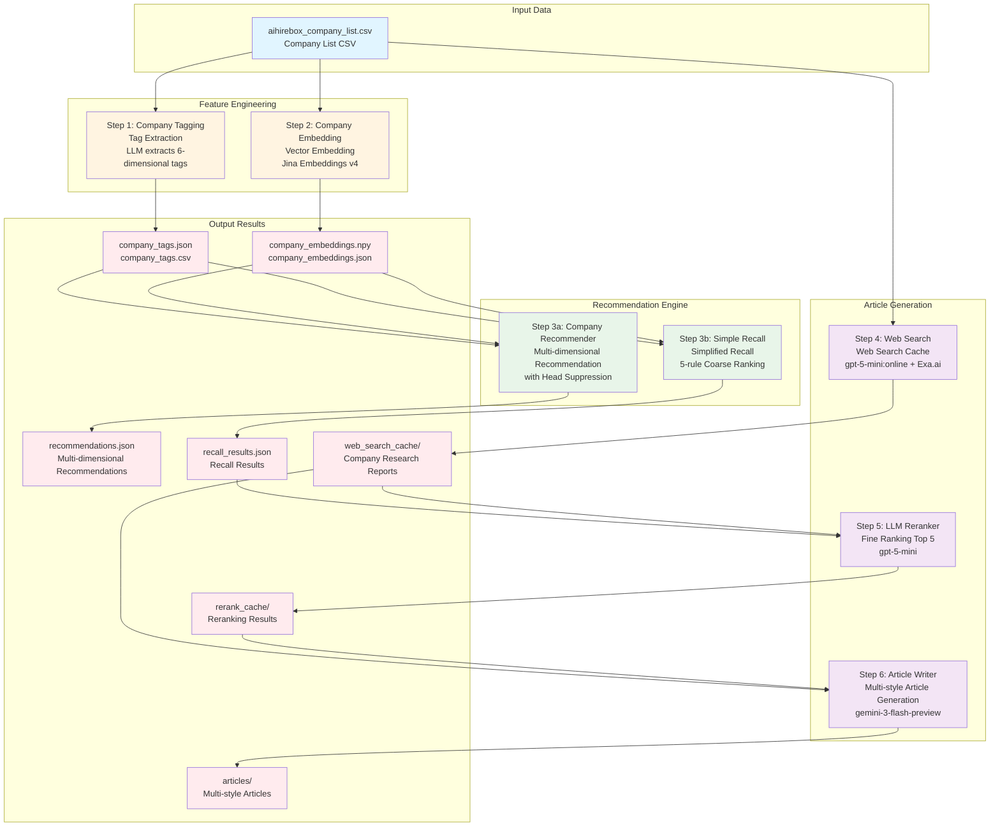
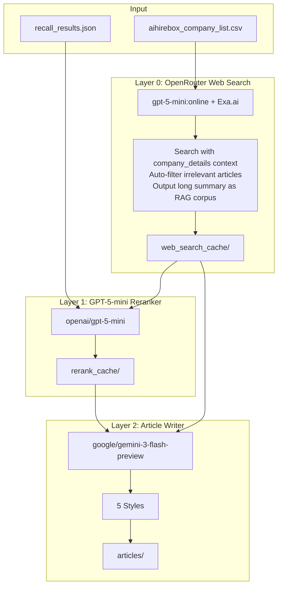

# AIHireBox Company Side Agentic Recsys

> [中文版本](./README.md)

This project builds the intelligent agent company consulting recommendation module under AIHireBox. Some code and documentation have been modified and generated by copilot agents such as Claude Code/Codex.

The core modules are:

1. **Feature Engineering** - LLM-based company tagging and Jina Embeddings for semantic representation
2. **Recommendation Engine** - Multi-dimensional company recommendation with head suppression
3. **Article Generation** - LLM-powered reranking and multi-style article writing via OpenRouter

## Prerequisites

- Python 3.10+
- API keys for:
  - OpenRouter (primary `OPENROUTER_API_KEY`; optional fallback `OPENROUTER_FALLBACK_API_KEY`)
  - Jina AI Embeddings (`JINA_API_KEY`) - for company embeddings

Copy `.env.example` to `.env` and fill in your keys:

```bash
cp .env.example .env
```

## Installation

### Using uv (Recommended)

[uv](https://github.com/astral-sh/uv) is a fast Python package installer and resolver.

```bash
# Install uv (if not already installed)
curl -LsSf https://astral.sh/uv/install.sh | sh

# Create virtual environment
uv venv

# Activate virtual environment
source .venv/bin/activate  # macOS/Linux
# or
.venv\Scripts\activate     # Windows

# Install dependencies
uv pip install -r requirements.txt
```

### Using pip

```bash
# Create virtual environment
python -m venv .venv

# Activate virtual environment
source .venv/bin/activate  # macOS/Linux
# or
.venv\Scripts\activate     # Windows

# Install dependencies
pip install -r requirements.txt
```

## Data Directory Structure

All production data is stored uniformly in the `output_production/` directory, organized by module subdirectories for containerized deployment:

```
output_production/
├── company_tagging/            # Company tagging module
│   ├── company_tags.json       # Company tags (LLM generated)
│   ├── company_tags.csv        # Tags in CSV format
│   └── run_metadata.json       # Run metadata
├── company_embedding/          # Vector embedding module
│   ├── company_embeddings.npy  # Vector embeddings (Jina Embeddings)
│   ├── company_embeddings.mapping.json
│   ├── company_embeddings.json
│   ├── company_embeddings.csv
│   └── run_metadata.json
├── recommender/                # Recommendation module
│   ├── recommendations.json    # Recommendation results
│   └── run_metadata.json
├── simple_recall/              # Simplified recall module
│   ├── recall_results.json     # Recall results
│   └── run_metadata.json
└── article_generator/          # Article generation module
    ├── web_search_cache/       # Web search cache
    ├── rerank_cache/           # LLM reranking cache
    └── articles/               # Generated articles
        ├── index.json          # Article index (grouped by company)
        ├── json/               # JSON format
        └── markdown/           # Markdown format
```

**Containerization Mount**: Only two directories need to be mounted:
- `data/` - Source data CSV
- `output_production/` - All production data

## Project Flowchart



**Flow Description**:
1. **Feature Engineering Stage**: Extract tags and generate vector embeddings from CSV
2. **Recommendation Engine Stage**: Perform recommendations based on tags and vectors (multi-dimensional recommendation or simplified recall)
3. **Article Generation Stage**: Web Search → LLM Reranking → Multi-style Article Generation (optional flow)

---

# Production Pipeline

The following is the complete production workflow, including **Tag Extraction → Vector Embedding → Company Recall → Article Generation** four stages.

> **Note**: All production data defaults to output in the `output_production/` directory, see [Data Directory Structure](#data-directory-structure). For detailed parameter descriptions, see the documentation for each module.

## Production Pipeline Summary

> All production data is stored uniformly in the `output_production/` directory (organized by module subdirectories), see [Data Directory Structure](#data-directory-structure).

### Article Generation Output Structure

Directory structure after article generation:

```
output_production/article_generator/articles/
├── index.json              # Detailed index (grouped by company, contains all article metadata)
├── json/                   # JSON format articles
│   ├── cid_100_R1_industry_36kr.json
│   ├── cid_100_R2_tech_focus_36kr.json
│   └── ...
└── markdown/               # Markdown format articles
    ├── cid_100_R1_industry_36kr.md
    ├── cid_100_R2_tech_focus_36kr.md
    └── ...
```

`index.json` contains complete metadata for each generation run, indexing all articles grouped by company.

---

### Scenario 1: Full Update (Initial Run or Preventing Data Drift)

**Applicable Scenarios**:
- First-time system initialization
- Periodic full updates (e.g., monthly/quarterly) to prevent data drift
- Fixing data quality issues requiring regeneration

#### Basic Flow (Tag Extraction → Vector Embedding → Recall)

```bash
# Step 1: Full tag extraction (overwrites existing data)
python run_tagging.py data/aihirebox_company_list.csv \
    --model openai/gpt-5-mini:online --no-reasoning

# Step 2: Full vector embedding (overwrites existing data)
python run_embedding.py data/aihirebox_company_list.csv

# Step 3: Full recall (recalculate recommendation relationships for all companies)
python run_simple_recommender.py --all \
    --output-dir output_production/simple_recall
```

#### Article Generation Flow (Optional)

```bash
# Step 4: Web Search cache (re-search all companies, without --skip-existing)
python run_web_search_cache.py \
    --company-csv data/aihirebox_company_list.csv \
    --output-dir output_production/article_generator/web_search_cache

# Step 5: LLM reranking (re-rank all results, without --skip-existing)
python run_reranker.py \
    --recall-results output_production/simple_recall/recall_results.json \
    --web-cache-dir output_production/article_generator/web_search_cache \
    --output-dir output_production/article_generator/rerank_cache

# Step 6: Generate articles (parallel mode, 20 concurrency)
# Outputs to articles/json/ and articles/markdown/, generates index.json
python run_article_writer.py \
    --rerank-dir output_production/article_generator/rerank_cache \
    --web-cache-dir output_production/article_generator/web_search_cache \
    --output-dir output_production/article_generator/articles \
    --concurrency 20 \
    --styles 36kr
```

---

### Scenario 2: Incremental Update (New Companies Added)

**Applicable Scenarios**:
- New companies added to the database
- Need to update tags, vectors, recall, and articles for new companies

**Important**: After new companies are added, **full recall must be re-run**, as new companies may affect recommendation relationships for existing companies.

#### Basic Flow

```bash
# Step 1: Incremental tag extraction (only process new companies, auto-detect or specify)
# Method 1: Auto-detect new companies (recommended)
python run_tagging.py data/aihirebox_company_list.csv \
    --merge output_production/company_tagging \
    --model openai/gpt-5-mini:online --quiet --no-reasoning

# Method 2: Specify new company IDs
python run_tagging.py data/aihirebox_company_list.csv \
    --company-ids cid_new_1 cid_new_2 \
    --merge output_production/company_tagging \
    --model openai/gpt-5-mini:online --quiet --no-reasoning

# Step 2: Incremental vector embedding (only process new companies)
python run_embedding.py data/aihirebox_company_list.csv \
    --merge output_production/company_embedding

# Step 3: Full recall (Important: must recalculate recommendation relationships for all companies)
python run_simple_recommender.py --all \
    --output-dir output_production/simple_recall
```

#### Article Generation Flow (Incremental)

```bash
# Step 4: Web Search cache (only search new companies)
python run_web_search_cache.py \
    --company-csv data/aihirebox_company_list.csv \
    --company-ids cid_new_1 cid_new_2 \
    --output-dir output_production/article_generator/web_search_cache

# Step 5: LLM reranking (only rerank recall results for new companies)
python run_reranker.py \
    --recall-results output_production/simple_recall/recall_results.json \
    --company-ids cid_new_1 cid_new_2 \
    --web-cache-dir output_production/article_generator/web_search_cache \
    --output-dir output_production/article_generator/rerank_cache

# Step 6: Generate articles (only generate articles for new companies, --skip-existing skips existing)
python run_article_writer.py \
    --rerank-dir output_production/article_generator/rerank_cache \
    --company-ids cid_new_1 cid_new_2 \
    --web-cache-dir output_production/article_generator/web_search_cache \
    --output-dir output_production/article_generator/articles \
    --concurrency 20 \
    --skip-existing \
    --styles 36kr
```

---

### Scenario 3: Partial Update (Only Update Web Search Cache)

**Applicable Scenarios**:
- Periodic company information updates (e.g., monthly updates)
- Only need to refresh Web Search cache, other data remains unchanged
- Cost optimization: only update parts that need updating

#### Update Web Search Cache

```bash
# Re-search all companies (without --skip-existing will overwrite existing cache)
python run_web_search_cache.py \
    --company-csv data/aihirebox_company_list.csv \
    --output-dir output_production/article_generator/web_search_cache
```

**Note**:
- This operation only updates Web Search cache, does not affect tags, vectors, recall results
- If you need to regenerate articles based on new Web Search results, you need to:
  1. Re-run reranking (using new Web Search cache)
  2. Regenerate articles

#### Optional: Regenerate Articles Based on New Web Search

```bash
# Re-rank (using new Web Search cache, without --skip-existing)
python run_reranker.py \
    --recall-results output_production/simple_recall/recall_results.json \
    --web-cache-dir output_production/article_generator/web_search_cache \
    --output-dir output_production/article_generator/rerank_cache

# Regenerate articles (without --skip-existing)
python run_article_writer.py \
    --rerank-dir output_production/article_generator/rerank_cache \
    --web-cache-dir output_production/article_generator/web_search_cache \
    --output-dir output_production/article_generator/articles \
    --styles 36kr xiaohongshu
```

---

## Data Analysis Tools

Use Jupyter Notebook to analyze recommendation result quality:

```bash
jupyter lab analyze_recommendations.ipynb
```

Analysis includes:
- 📊 Per-company recommendation statistics (dimension count, recommendation count, average score)
- 📈 Similarity score distribution (final score / tag score / embedding score)
- 🏷️ Dimension usage frequency analysis
- ⬇️ Head suppression effect evaluation
- 🔄 Mutual recommendation network analysis
- 🎯 Quality assessment summary and rating

### Dependencies

```
openai>=1.30.0
numpy>=1.24.0
python-dotenv>=1.0.1
requests>=2.32.0
tqdm>=4.66.0
```

---

# Feature Engineering

## Company Tagging (`company_tagging.py`)

Core module for extracting MECE (Mutually Exclusive, Collectively Exhaustive) tags from company details using LLM.

**[TAG_TAXONOMY](./company_tagging.py)** was generated directly by anthropic/claude-opus-4.5 from samples of [aihirebox_company_list.csv](./data/aihirebox_company_list.csv).

### Tag Dimensions (6 Dimensions)

| Dimension | Chinese Name | Type | Options |
|-----------|--------------|------|---------|
| **industry** | Industry | Multi | `ai_llm`, `robotics`, `edtech`, `fintech`, `healthtech`, `enterprise_saas`, `ecommerce`, `gaming`, `social`, `semiconductor`, `automotive`, `consumer_hw`, `cloud_infra`, `content_media`, `biotech`, `investment`, `other` |
| **business_model** | Business Model | Multi | `b2b`, `b2c`, `b2b2c`, `platform`, `saas`, `hardware`, `marketplace`, `consulting` |
| **target_market** | Target Market | Multi | `china_domestic`, `global`, `sea`, `us`, `europe`, `japan_korea`, `latam`, `mena` |
| **company_stage** | Company Stage | Single | `seed`, `early`, `growth`, `pre_ipo`, `public`, `bigtech_subsidiary`, `profitable`, `unknown` |
| **tech_focus** | Tech Focus | Multi | `llm_foundation`, `computer_vision`, `speech_nlp`, `embodied_ai`, `aigc`, `3d_graphics`, `chip_hardware`, `data_infra`, `autonomous`, `blockchain`, `quantum`, `not_tech_focused` |
| **team_background** | Team Background | Multi | `bigtech_alumni`, `top_university`, `serial_entrepreneur`, `academic`, `industry_expert`, `international`, `unknown` |

### Basic Usage

```bash
# Full processing (production use, defaults to output_production/company_tagging/)
python run_tagging.py data/aihirebox_company_list.csv \
    --model openai/gpt-5-mini:online --quiet --no-reasoning

# Process specific companies (supports --company-ids or --company-ids-json)
python run_tagging.py data/aihirebox_company_list.csv \
    --company-ids cid_0 cid_1 --merge output_production/company_tagging

# Incremental update (auto-detect new companies)
python run_tagging.py data/aihirebox_company_list.csv \
    --merge output_production/company_tagging \
    --model openai/gpt-5-mini:online --quiet --no-reasoning
```

### Checkpoint & Resume

The script saves intermediate results every 10 companies by default to prevent data loss from interruption:

```bash
# Custom checkpoint interval (save every 5 companies)
python run_tagging.py data/aihirebox_company_list.csv --checkpoint-interval 5

# Resume from last interruption (auto-skip already processed companies)
python run_tagging.py data/aihirebox_company_list.csv --resume

# Combined usage: when processing many companies, save every 20
python run_tagging.py data/aihirebox_company_list.csv \
    --checkpoint-interval 20 --resume
```

**How it works**:
- Every N companies processed, automatically save `company_tags.csv` and `company_tags.json`
- If program is interrupted (Ctrl+C or error), already processed companies are not lost
- Using `--resume` when re-running automatically skips already processed companies
- Compatible with `--merge` mode, checkpoint can also be used during incremental updates

### Output Format

CSV output uses `|` as multi-select field separator:

```csv
company_id,company_name,industry,business_model,target_market,company_stage,tech_focus,team_background,confidence_score,reasoning
cid_0,Apex Context,ai_llm|content_media,b2c|saas,global,early,llm_foundation|aigc,bigtech_alumni|top_university,0.90,The company focuses on...
```

---

## Company Embedding (`company_embedding.py`)

Transforms company information (name, location, description) into vector representations for semantic retrieval and similarity computation. Uses Jina Embeddings v4 multilingual model.

### Jina Embeddings v4 Features

- **Multilingual Support**: Native support for Chinese, English, and many other languages
- **Multimodal**: Supports text and image input
- **Task Adaptation**: Uses LoRA adapters optimized for different tasks (retrieval, text-matching, classification)
- **Flexible Dimensions**: Supports 128-2048 dimension vectors

### Configuration

| Parameter | Default | Description |
|-----------|---------|-------------|
| `model` | `jina-embeddings-v4` | Model name |
| `dimensions` | `1024` | Vector dimensions (128/256/512/1024/2048) |
| `task` | `retrieval.passage` | Task type (for LoRA adapter selection) |
| `batch_size` | `32` | Batch processing size |

### Basic Usage

```bash
# Full processing (defaults to output_production/company_embedding/)
python run_embedding.py data/aihirebox_company_list.csv

# Process specific companies (supports --company-ids or --company-ids-json)
python run_embedding.py data/aihirebox_company_list.csv \
    --company-ids cid_0 cid_1 --merge output_production/company_embedding

# Incremental update (auto-detect new companies)
python run_embedding.py data/aihirebox_company_list.csv \
    --merge output_production/company_embedding

# Custom parameters (--dimensions, --quiet, --resume, etc.)
python run_embedding.py data/aihirebox_company_list.csv --dimensions 2048
```

### Output Format

Output saved to `output/company_embeddings_<timestamp>/` directory:

```
output/company_embeddings_20251219_120000/
├── company_embeddings.csv       # CSV with vectors (embedding stored as JSON string)
├── company_embeddings.json      # Complete data in JSON format
├── company_embeddings.npy       # NumPy array format (for computation)
├── company_embeddings.mapping.json  # company_id to array index mapping
└── run_metadata.json            # Run metadata
```

### Python API

```python
from company_embedding import CompanyEmbedder, load_companies_from_csv

# Initialize
embedder = CompanyEmbedder(
    api_key="your_jina_api_key",
    dimensions=1024,
    task="retrieval.passage",
)

# Load company data
companies = load_companies_from_csv("data/aihirebox_company_list.csv")

# Generate embeddings
results = embedder.embed_companies(companies, show_progress=True)

# Use vectors
for result in results:
    print(f"{result.company_id}: {len(result.embedding)} dims")
```

### Loading Embeddings for Computation

```python
import numpy as np
from company_embedding import load_embeddings_npy

# Load vectors and mapping
embeddings, mapping = load_embeddings_npy("output_embeddings/company_embeddings.npy")

# Calculate similarity
from numpy.linalg import norm

def cosine_similarity(a, b):
    return np.dot(a, b) / (norm(a) * norm(b))

# Get vector for specific company
idx = mapping["cid_0"]
vector = embeddings[idx]

# Find most similar companies
similarities = [cosine_similarity(vector, embeddings[i]) for i in range(len(embeddings))]
```

### Cost Estimation

- 132 companies × ~300 tokens/company ≈ 40,000 tokens
- Jina free quota: 1M tokens/month
- Estimated cost: Nearly free (within free quota)

### Environment Variables

Configure in `.env` file:

```bash
JINA_API_KEY=your_jina_api_key_here
```

---

# Company Recommendation Details

## Simple Recall Recommender (`simple_recommender.py`)

Simplified company recall module based on 5 rules for candidate recall, used for subsequent LLM reranking to generate industry report articles.

### Design Goals

- **Simple and Controllable**: 5 clear recall rules, each rule recalls Top 20 candidates
- **Lightweight Head Suppression**: Only uses `CompanyStageHeadSuppression` (50% penalty), not `IDFHeadSuppression`
- **Output Raw Data**: Data for LLM reranking includes `company_name`, `location`, `company_details`, avoiding tag coupling

### 5 Recall Rules

| Rule ID | Rule Name | Match Condition | Story Angle |
|---------|-----------|-----------------|-------------|
| R1_industry | Core Industry | `industry` intersection | "Companies in the same XX industry" |
| R2_tech_focus | Tech Route | `tech_focus` intersection | "Companies with the same XX technology direction" |
| R3_industry_market | Industry+Market | `industry` + `target_market` both intersect | "Same industry going overseas/domestic" |
| R4_team_background | Team Profile | `team_background` intersection | "Same big tech alumni/academic background" |
| R5_industry_team | Industry+Team | `industry` + `team_background` both intersect | "Same industry with similar team backgrounds" |

### Scoring Formula

```python
tag_score = |query_tags ∩ candidate_tags| / |query_tags ∪ candidate_tags|  # Jaccard
embedding_score = cosine_similarity(query_emb, candidate_emb)
final_score = 0.6 * tag_score + 0.4 * embedding_score

# Head suppression (only 50% penalty for public/bigtech_subsidiary/profitable/pre_ipo)
if company.company_stage in HEAD_COMPANY_STAGES:
    final_score = final_score * 0.5
```

### Usage

```bash
# Basic usage
python run_simple_recommender.py --company-id cid_100 --print-only
python run_simple_recommender.py --all --output-dir output_production/simple_recall

# Custom parameters (--top-k, --no-head-suppression)
python run_simple_recommender.py --company-id cid_100 --top-k 30
```

### Output Format

```json
{
  "query_company": {
    "company_id": "cid_100",
    "company_name": "MiniMax",
    "location": "Jimen One",
    "company_details": "MiniMax is an AI company focused on general large model R&D..."
  },
  "recall_groups": [
    {
      "rule_id": "R1_industry",
      "rule_name": "Same Industry Companies",
      "rule_story": "Companies in the AI large model and enterprise services sectors",
      "matched_tags": {"industry": ["ai_llm", "enterprise_saas"]},
      "candidates": [
        {
          "company_id": "cid_114",
          "company_name": "Moonshot AI",
          "location": "Beijing Haidian District...",
          "company_details": "Moonshot AI is a...",
          "final_score": 0.92,
          "tag_score": 0.85,
          "embedding_score": 0.78,
          "head_penalty_applied": false
        }
      ]
    }
  ]
}
```

### Key Parameters

| Parameter | Default | Description |
|-----------|---------|-------------|
| `top_k` | 20 | Number of candidates recalled per rule |
| `head_suppression` | True | Whether to enable head suppression |
| `head_penalty` | 0.5 | Head company penalty ratio |

### Python API

```python
from simple_recommender import (
    SimpleRecallRecommender,
    load_data_for_recommender,
    print_recall_result,
)

# Load data
profiles, raw_companies, embeddings, mapping = load_data_for_recommender(
    raw_csv_path=Path("data/aihirebox_company_list.csv"),
    tags_json_path=Path("output_production/company_tagging/company_tags.json"),
    embeddings_dir=Path("output_production/company_embedding"),
)

# Initialize recommender
recommender = SimpleRecallRecommender(
    profiles=profiles,
    raw_companies=raw_companies,
    embeddings=embeddings,
    embedding_mapping=mapping,
    head_suppression=True,
    head_penalty=0.5,
)

# Execute recall
result = recommender.recall("cid_100", top_k=20)

# Print results
print_recall_result(result)
```

---

## Multi-Dimensional Company Recommender (`company_recommender.py`)

Multi-dimensional company recommendation system based on tags and vector embeddings, supporting **head suppression** to prevent large companies from monopolizing recommendation results.

### System Architecture

```
┌─────────────────────────────────────────────────────────────────────┐
│                    Company Recommender                               │
├─────────────────────────────────────────────────────────────────────┤
│                                                                      │
│  ┌──────────────┐    ┌──────────────┐    ┌───────────────────────┐ │
│  │ Tag Index    │    │ Embedding    │    │ Head Suppression      │ │
│  │ (Inverted)   │    │ Index        │    │ Strategy              │ │
│  └──────────────┘    └──────────────┘    └───────────────────────┘ │
│         │                  │                       │               │
│         └────────┬─────────┘                       │               │
│                  ▼                                 │               │
│         ┌────────────────────┐                     │               │
│         │ Multi-Dimension    │◄────────────────────┘               │
│         │ Candidate Gen      │                                     │
│         └────────────────────┘                                     │
│                  │                                                  │
│                  ▼                                                  │
│         ┌────────────────────┐                                     │
│         │ Dimension Labeling │                                     │
│         │ & Ranking          │                                     │
│         └────────────────────┘                                     │
│                  │                                                  │
│                  ▼                                                  │
│             Final Output                                            │
│   [{dimension: "AI LLM", companies: [A,B,C]}, ...]                 │
└─────────────────────────────────────────────────────────────────────┘
```

### Recommendation Dimensions

The system generates recommendations from the following dimensions:

| Dimension Type | Example Tags | Description |
|----------------|--------------|-------------|
| **industry** | `ai_llm`, `robotics`, `fintech` | Same industry sector |
| **business_model** | `b2b`, `platform`, `saas` | Same business model |
| **target_market** | `global`, `china_domestic`, `sea` | Same target market |
| **tech_focus** | `llm_foundation`, `embodied_ai` | Same technology direction |
| **team_background** | `serial_entrepreneur`, `bigtech_alumni` | Same team background |
| **semantic** | - | Similar business descriptions |

### Head Suppression Strategy

Prevents large/popular companies from monopolizing all recommendation slots:

| Strategy | Description | Default Weight |
|----------|-------------|----------------|
| **CompanyStageHeadSuppression** | Penalty for companies at `public`, `bigtech_subsidiary`, `profitable`, `pre_ipo` stages | 60% |
| **IDFHeadSuppression** | Penalty for companies with too many tags (too "generic") | 40% |

**Calculation Formula:**

```
# 1. Each strategy calculates penalty coefficient
stage_penalty = 0.6 if is_head_company else 0        # Fixed penalty for head companies
idf_penalty   = (tag_count / max_tags) × 0.4         # More tags = higher penalty

# 2. Weighted average (normalized weights)
total_penalty = 0.6 × stage_penalty + 0.4 × idf_penalty
total_penalty = min(total_penalty, 0.9)              # Penalty cap at 90%

# 3. Apply to score
adjusted_score = raw_score × (1 - total_penalty)
```

**Example**:
- A `public` stage head company with 15 tags (max_tags=20)
  - `stage_penalty = 0.6`
  - `idf_penalty = (15/20) × 0.4 = 0.3`
  - `total_penalty = 0.6 × 0.6 + 0.4 × 0.3 = 0.36 + 0.12 = 0.48`
  - `adjusted_score = raw_score × 0.52` (48% penalty)

- A `seed` stage startup with 5 tags
  - `stage_penalty = 0`
  - `idf_penalty = (5/20) × 0.4 = 0.1`
  - `total_penalty = 0.6 × 0 + 0.4 × 0.1 = 0.04`
  - `adjusted_score = raw_score × 0.96` (only 4% penalty)

> The `CompanyStageHeadSuppression` penalty strength can be adjusted via the `--head-penalty` parameter (default 0.6).

### Score Threshold Filtering

Controls recommendation quality by filtering low-similarity companies:

| Parameter | Default | Description |
|-----------|---------|-------------|
| `score_threshold` | 0.5 | Companies below this score are not recommended |
| `max_below_threshold` | 2 | If more than this number are below threshold in a dimension, discard the entire dimension |

Example: Setting `--score-threshold 0.7 --max-below-threshold 2` means:
- Companies with similarity < 0.7 will not appear in recommendations
- If a dimension has more than 2 candidate companies below 0.7, that dimension is skipped

### Embedding Boost

Combines **tag-based similarity** with **embedding semantic similarity** to improve recommendation quality:

```
final_score = (1 - weight) × tag_score + weight × embedding_score
            = 0.6 × tag_score + 0.4 × embedding_score
```

**Score Explanation:**

| Score | Calculation Method | Description |
|-------|-------------------|-------------|
| `tag_score` | Jaccard(query_tags, candidate_tags) | Tag set similarity for current dimension = \|common tags\| / \|union tags\| |
| `embedding_score` | Cosine(query_emb, candidate_emb) | Semantic similarity of company descriptions (based on Jina Embeddings) |
| `final_score` | Weighted fusion score | Final score used for ranking and threshold filtering |

**Note**: `tag_score` is the Jaccard similarity for the **current recommendation dimension** (e.g., `industry` or `business_model`), not the average of all tag categories.

- Enabled by default, can be disabled with `--no-embedding-boost`
- Output displays embedding score: `(similarity: 0.84⬇, emb=0.73)`
- Requires running `run_embedding.py` first to generate embeddings

### Usage

```bash
# Basic usage (single company/multiple companies/all)
python run_recommender.py --company-id cid_100
python run_recommender.py --company-ids cid_100 cid_109
python run_recommender.py --all --score-threshold 0.6

# Common parameters
python run_recommender.py --company-id cid_100 \
    --score-threshold 0.7 \
    --head-penalty 0.7 \
    --num-dimensions 5

# Advanced options (--no-embedding-boost, --no-semantic, --no-diversity, --print-only)
python run_recommender.py --company-id cid_100 --print-only
```

### Output Example

```
======================================================================
Recommendation Results: MiniMax (cid_100)
======================================================================

【Dimension 1】B2B Enterprise Services
  Reason: These companies are similar to MiniMax in B2B enterprise services
  Shared Tags: saas, b2b, b2c, platform
  Recommended Companies:
    - Pollo.ai (similarity: 0.84⬇, emb=0.73)
    - Fudian Qiji (similarity: 0.84⬇, emb=0.79)
    - Apex Context (similarity: 0.83⬇, emb=0.76)
    - Genvox (similarity: 0.83⬇, emb=0.76)
    - XiaoIce (similarity: 0.83⬇, emb=0.80)

【Dimension 2】Big Tech Alumni Teams
  Reason: These companies are similar to MiniMax in big tech alumni team background
  Shared Tags: bigtech_alumni, academic, international, top_university
  Recommended Companies:
    - Shenyan Tech (similarity: 0.84⬇, emb=0.75)
    - 01.AI (similarity: 0.83⬇, emb=0.78)
    - Moonshot AI (similarity: 0.81⬇, emb=0.74)

【Dimension 3】Similar Business Description
  Reason: These companies have semantically similar business descriptions to MiniMax
  Shared Tags: semantic
  Recommended Companies:
    - Fudian Qiji (similarity: 0.71⬇, emb=0.77)
    - Zhiyuan Robot (similarity: 0.69⬇, emb=0.73)

----------------------------------------------------------------------
Total Dimensions: 5
Head Suppression: Enabled (⬇ = penalty applied)
Score Threshold: 0.6
Embedding Boost: Enabled
```

**Notes**:
- `similarity: 0.84⬇` - Final score (with head suppression), ⬇ indicates penalty applied
- `emb=0.73` - Embedding semantic similarity score

### Output Format (JSON)

```json
{
  "query_company_id": "cid_100",
  "query_company_name": "MiniMax",
  "recommendation_groups": [
    {
      "dimension_key": "business_model_b2b",
      "dimension_label_zh": "B2B Enterprise Services",
      "dimension_label_en": "B2B Enterprise Services",
      "reason": "These companies are similar to MiniMax in B2B enterprise services",
      "shared_tags": ["saas", "b2b", "platform"],
      "companies": [
        {
          "company_id": "cid_5",
          "company_name": "Pollo.ai",
          "similarity_score": 0.84,
          "raw_score": 0.95,
          "head_penalty_applied": true,
          "embedding_score": 0.73
        }
      ]
    }
  ],
  "metadata": {
    "num_dimensions": 5,
    "head_suppression_applied": true,
    "diversity_constraint": true,
    "score_threshold": 0.6,
    "max_below_threshold": 2,
    "use_embedding_boost": true
  }
}
```

### Python API

```python
from company_recommender import (
    CompanyRecommender,
    load_company_profiles,
    load_embeddings,
    print_recommendations,
)

# Load data
profiles = load_company_profiles("output_production/company_tagging/company_tags.json")
embeddings, mapping = load_embeddings("output_production/company_embedding/company_embeddings.npy")

# Initialize recommender
recommender = CompanyRecommender(
    companies=profiles,
    embeddings=embeddings,
    embedding_mapping=mapping,
    head_penalty=0.6,  # Head suppression strength
)

# Generate recommendations
recs = recommender.recommend(
    "cid_100",
    num_dimensions=5,
    min_companies_per_dim=3,
    max_companies_per_dim=5,
    score_threshold=0.6,        # Minimum score threshold
    max_below_threshold=2,      # If more than this below threshold, discard dimension
    use_embedding_boost=True,   # Use embedding boost
)

# Print results
print_recommendations(recs)
```

### Key Parameters

| Parameter | Default | Description |
|-----------|---------|-------------|
| `num_dimensions` | 5 | Number of recommendation dimensions (3-5) |
| `min_companies_per_dim` | 3 | Minimum companies per dimension |
| `max_companies_per_dim` | 5 | Maximum companies per dimension |
| `head_penalty` | 0.6 | Head suppression strength (0-1) |
| `score_threshold` | 0.5 | Minimum similarity threshold, don't recommend below this |
| `max_below_threshold` | 2 | If more than this below threshold, discard entire dimension |
| `include_semantic` | True | Whether to include semantic similarity dimension |
| `diversity_constraint` | True | Whether to limit each company to appear in only one dimension |
| `use_embedding_boost` | True | Whether to use embedding boost for tag similarity |
| `embeddings_dir` | Auto | Embeddings directory path (auto-finds latest) |

---

# LLM Reranking and Article Generation System (`article_generator/`)

Three-layer architecture system for generating multi-style industry analysis articles based on recall results.

## System Architecture



## Three-Layer Processing Flow

| Layer | Module | Input | Output | Model |
|-------|--------|-------|--------|-------|
| **Layer 0** | Web Search | company CSV | Company research report (800-1500 words) | `gpt-5-mini:online` + Exa.ai |
| **Layer 1** | Reranker | Recall results + Web Search cache | Selected Top 5 companies + narrative angle | `gpt-5-mini` |
| **Layer 2** | Article Writer | Reranking results + Web Search cache | Multi-style articles | `gemini-3-flash-preview` |

## Layer 0: Web Search (`run_web_search_cache.py`)

Uses OpenRouter `:online` suffix to enable Exa.ai search, with company_details context to auto-filter irrelevant articles.

### How It Works

1. Add `:online` after model slug (e.g., `openai/gpt-5-mini:online`)
2. OpenRouter uses **Exa.ai** to execute search and summarize results
3. Searches with company_details as context, model auto-filters irrelevant articles
4. Outputs 800-1500 word company research report as downstream RAG corpus

### Usage

```bash
# Search all companies (supports --company-ids or --company-ids-json)
python run_web_search_cache.py \
    --company-csv data/aihirebox_company_list.csv \
    --output-dir output_production/article_generator/web_search_cache \
    --skip-existing
```

### Output Format

One JSON file per company (`{company_id}.json`):

```json
{
  "company_id": "cid_100",
  "company_name": "MiniMax",
  "query_used": "Please search and summarize the latest information about the following company...",
  "search_summary": "## Company Overview\nMiniMax is an AI company focused on general large model R&D...\n\n## Latest Updates\n...",
  "citations": ["https://36kr.com/...", "https://www.thepaper.cn/..."],
  "is_valid": true,
  "searched_at": "2024-12-21T10:30:00"
}
```

### Pricing

- **$4 / 1,000 web searches**
- Default returns 10 search results per request

## Layer 1: LLM Reranker (`run_reranker.py`)

Uses GPT-5-mini to select Top 5 most relevant companies from each rule's 20 candidates.

### Usage

```bash
# Basic usage (supports --company-ids for specific companies, --web-cache-dir to enhance reranking)
python run_reranker.py \
    --recall-results output_production/simple_recall/recall_results.json \
    --output-dir output_production/article_generator/rerank_cache \
    --skip-existing
```

### Output Format

One JSON file per (query_company, rule) pair (`{company_id}_{rule_id}.json`):

```json
{
  "query_company_id": "cid_100",
  "query_company_name": "MiniMax",
  "rule_id": "R1_industry",
  "rule_name": "Same Industry Companies",
  "narrative_angle": "These are all teams building startups in the large model application layer, each finding unique vertical scenarios",
  "selected_companies": [
    {
      "company_id": "cid_114",
      "company_name": "Moonshot AI",
      "location": "Beijing Haidian District...",
      "company_details": "...",
      "selection_reason": "Core business is highly complementary to the query company, enabling comparative analysis"
    }
  ],
  "reranked_at": "2024-12-21T10:35:00"
}
```

## Layer 2: Article Writer (`run_article_writer.py`)

Uses Gemini to generate multi-style articles, **supporting parallel OpenRouter API calls** for significantly improved generation speed.

### Parallel Processing

The script uses 5 parallel workers by default to call the OpenRouter API. Paid keys have no request rate limits (`requests = -1`), so high concurrency can be safely used.

```bash
# Default 5 concurrency
python run_article_writer.py --rerank-dir ... --output-dir ...

# High concurrency mode (10 concurrency)
python run_article_writer.py --concurrency 10 --rerank-dir ... --output-dir ...

# Serial mode (legacy compatible, for debugging)
python run_article_writer.py --concurrency 1 --rerank-dir ... --output-dir ...
```

**Performance Comparison** (132 companies × 2 styles = 264 articles):
| Mode | Concurrency | Estimated Time |
|------|-------------|----------------|
| Serial | 1 | ~22 minutes (5s/article) |
| Default | 5 | ~5 minutes |
| High Concurrency | 10 | ~3 minutes |

> **Note**: If encountering 429 errors, they usually come from upstream model providers (like Google/OpenAI), reduce concurrency as needed.

### 5 Article Styles

| Style | Word Count | Emoji | Features |
|-------|------------|-------|----------|
| **36kr** | 800-1200 | ❌ | Professional, data-driven, industry analysis |
| **huxiu** | 1000-1500 | ❌ | Sharp, opinionated, deep commentary |
| **xiaohongshu** | 500-800 | ✅ | Casual, conversational, bullet points |
| **linkedin** | 600-1000 | ❌ | Career perspective, emphasizes opportunities |
| **zhihu** | 1000-1500 | ❌ | Knowledge sharing, logical and clear |

Style templates are in the `prompts/article_styles/` directory.

### Usage

```bash
# Basic usage (default 5 concurrency, supports --company-ids for specific companies, --styles for specific styles)
python run_article_writer.py \
    --rerank-dir output_production/article_generator/rerank_cache \
    --web-cache-dir output_production/article_generator/web_search_cache \
    --output-dir output_production/article_generator/articles \
    --styles 36kr xiaohongshu

# High concurrency mode (10 concurrency, suitable for paid keys)
python run_article_writer.py \
    --rerank-dir output_production/article_generator/rerank_cache \
    --web-cache-dir output_production/article_generator/web_search_cache \
    --output-dir output_production/article_generator/articles \
    --concurrency 10 \
    --styles 36kr xiaohongshu
```

### Output Format

Two files per article:
- `{company_id}_{rule_id}_{style}.json` - Structured data
- `{company_id}_{rule_id}_{style}.md` - Markdown format

```json
{
  "query_company_id": "cid_100",
  "query_company_name": "MiniMax",
  "rule_id": "R1_industry",
  "style": "36kr",
  "title": "Differentiated Competition in the Large Model Track: Technology Path Comparison Between MiniMax and 5 Leading AI Companies",
  "content": "In 2024, with the large model track in fierce competition...",
  "word_count": 1050,
  "key_takeaways": [
    "MiniMax focuses on multimodal large models",
    "Moonshot AI excels in long context technology",
    "..."
  ],
  "citations": ["https://36kr.com/..."],
  "generated_at": "2024-12-21T10:40:00"
}
```

## Complete Pipeline

```bash
# Step 0: Generate recall results (if not already done)
python run_simple_recommender.py --all \
    --output-dir output_production/simple_recall

# Step 1: Web Search cache (search all company information)
python run_web_search_cache.py \
    --company-csv data/aihirebox_company_list.csv \
    --output-dir output_production/article_generator/web_search_cache \
    --skip-existing

# Step 2: LLM reranking
python run_reranker.py \
    --recall-results output_production/simple_recall/recall_results.json \
    --web-cache-dir output_production/article_generator/web_search_cache \
    --output-dir output_production/article_generator/rerank_cache \
    --skip-existing

# Step 3: Generate articles (default 5 concurrency, 36kr + xiaohongshu styles)
python run_article_writer.py \
    --rerank-dir output_production/article_generator/rerank_cache \
    --web-cache-dir output_production/article_generator/web_search_cache \
    --output-dir output_production/article_generator/articles \
    --concurrency 10 \
    --styles 36kr xiaohongshu \
    --skip-existing
```

## Cost Estimation

| Item | Quantity | Unit Price | Total Cost |
|------|----------|------------|------------|
| Web Search + Summary | 132 companies | $4/1000 + ~$0.003/call | ~$0.93 |
| Reranker | 132 x 5 rules | ~$0.002/call | ~$1.32 |
| Article Writer | 132 x 5 rules x 2 styles | ~$0.005/call | ~$6.60 |
| **Total** | | | **~$8.85** |

> Note: Estimate using 2 styles (36kr + xiaohongshu)

## Python API

```python
from article_generator import (
    OpenRouterWebSearcher,
    LLMReranker,
    ArticleWriter,
    ARTICLE_STYLES,
)

# Layer 0: Web Search
searcher = OpenRouterWebSearcher()
web_result = searcher.search_company("cid_100", "MiniMax", "MiniMax is a...")

# Layer 1: Reranker
reranker = LLMReranker()
rerank_result = reranker.rerank(query_company, candidates, "R1_industry", top_k=5)

# Layer 2: Article Writer
writer = ArticleWriter()
article = writer.write_article(rerank_result, style_id="36kr", web_search_cache={})

print(f"Title: {article.title}")
print(f"Content: {article.content[:200]}...")
```

---

## Data Format

### Input CSV Specification

The input CSV file must contain the following columns:

| Column | Type | Required | Description |
|--------|------|----------|-------------|
| `company_id` | string | ✓ | Unique identifier for the company (e.g., `cid_0`, `cid_80`) |
| `company_name` | string | ✓ | Company name, may include Chinese name in parentheses |
| `location` | string | ✓ | Company location/address |
| `company_details` | string | ✓ | Detailed company description (Chinese, typically 100-500 chars) |

### Example CSV

```csv
company_id,company_name,location,company_details
cid_80,JOJOMath (Chengdu Shusheng Technology Co., Ltd.),China (Sichuan) Free Trade Zone,JOJO is an AI education unicorn for children worldwide...
cid_0,Apex Context,Zituo International Plaza,Apex Context focuses on AI large models...
```

### Available Data Files

See [sample data here](https://alidocs.dingtalk.com/i/nodes/GZLxjv9VGqaDL19MCxyjj0g286EDybno?utm_scene=person_space&iframeQuery=sheet_range%3Dst-2cb3c309-95650_44_3_1_1).

Download and save it as `data/aihirebox_company_list.csv`.

| File | Companies | Description |
|------|-----------|-------------|
| `data/aihirebox_company_list.csv` | 132 | Complete company list |
| `data/aihirebox_company_list_sample.csv` | 32 | Test sample |
| `data/aihirebox_company_list_n1_sample.csv` | 1 | Single test sample |

### Embeddings Data

The recommendation system requires embeddings data to enable embedding boost and semantic dimensions:

```bash
# Generate embeddings for all 132 companies (defaults to output_production/company_embedding/)
python run_embedding.py data/aihirebox_company_list.csv
```

| Directory | Company Count | Description |
|-----------|---------------|-------------|
| `output_production/company_embedding/` | 132 | Complete embeddings (production use) |
| `output/company_embeddings_<timestamp>/` | Varies | Historical run results (development/testing) |

---

## Project Structure

```
aihirebox-company-recsys/
├── company_tagging.py              # Core tagging module (contains CompanyTagger class)
├── company_embedding.py            # Core embedding module (contains CompanyEmbedder class)
├── company_recommender.py          # Core recommendation engine (contains CompanyRecommender class)
├── simple_recommender.py           # Simplified recall module (5-rule coarse ranking for LLM reranking)
├── run_tagging.py                  # Production tagging script
├── run_embedding.py                # Production embedding script
├── run_recommender.py              # Production recommendation script
├── run_simple_recommender.py       # Simplified recall script
├── run_web_search_cache.py         # Web Search cache script
├── run_reranker.py                 # LLM reranking script
├── run_article_writer.py           # Article generation script
├── article_generator/              # Article generation module
│   ├── __init__.py
│   ├── models.py                       # Data models
│   ├── web_searcher.py                 # OpenRouter :online Web Search
│   ├── reranker.py                     # GPT-5-mini reranker
│   ├── article_writer.py               # Gemini article generator
│   └── styles.py                       # 5 article style definitions
├── prompts/                        # Prompt templates
│   └── article_styles/                 # Style writing guides
│       ├── 36kr.md
│       ├── huxiu.md
│       ├── xiaohongshu.md
│       ├── linkedin.md
│       └── zhihu.md
├── data/                           # Data files
│   ├── aihirebox_company_list.csv      # Complete company list (132 companies)
│   ├── aihirebox_company_list_sample.csv # Test sample (32 companies)
│   ├── aihirebox_company_list_n1_sample.csv # Single sample (1 company)
│   └── company_list.txt                # Original company data
├── tests/                          # Test scripts
│   ├── test_tagging_models.py          # Model comparison tests
│   ├── test_tagging_with_websearch.py  # Web search enhancement tests
│   └── fixtures/                       # Test data
├── scripts/                        # Utility scripts
│   └── merge_comparison.py             # Result merging tool
├── output/                         # Development/test output directory
├── output_production/              # Production data directory
│   ├── company_tagging/                # Company tags
│   ├── company_embedding/              # Vector embeddings
│   ├── recommender/                    # Recommendation results
│   ├── simple_recall/                  # Simplified recall results
│   └── article_generator/              # Article generation
│       ├── web_search_cache/           # Web search cache
│       ├── rerank_cache/               # Reranking cache
│       └── articles/                   # Generated articles
│           ├── index.json              # Article index (grouped by company)
│           ├── json/                   # JSON format
│           └── markdown/               # Markdown format
├── .env.example                    # Environment variables example
├── .gitignore
├── requirements.txt
└── README.md
```

---

## Key Insights

1. **Default Model**: `openai/gpt-5-mini:online` - Enables web search to improve team_background accuracy
2. **Team Background Issue**: Base models have low recognition rate for team backgrounds, using Web Search can improve by 20-30%
3. **Cost Tradeoff**: Web Search improves accuracy but increases cost and latency, recommend using only when high accuracy is needed
4. **Vector Embeddings**: Uses Jina Embeddings v4 for semantic encoding of company_name, location, company_details, supporting subsequent similarity retrieval
5. **Head Suppression**: Recommendation system defaults to 60% penalty for large companies (public, bigtech_subsidiary, etc.) to prevent all AI startups from being recommended ByteDance, Alibaba, etc.
6. **Score Threshold**: Can set minimum score threshold to filter low-quality recommendations; if a dimension has too many low-scoring candidates, skip that dimension
7. **Embedding Boost**: Tag similarity fused with embedding semantic similarity (default 6:4 weight) to improve recommendation accuracy
8. **Simplified Recall**: `simple_recommender.py` provides 5-rule coarse ranking recall with lightweight head suppression (50%), outputting raw data for LLM reranking
9. **Three-Layer Article Generation**: Web Search (RAG) → LLM Reranker (select Top 5) → Article Writer (multi-style generation)
10. **Parallel Article Generation**: `run_article_writer.py` defaults to 5 concurrent OpenRouter API calls, paid keys have no rate limits, can set `--concurrency 10` for high concurrency acceleration

## Notes

- `company_tagging.py` provides the core `CompanyTagger` class and utility functions
- `company_embedding.py` provides the core `CompanyEmbedder` class for generating vector embeddings
- `company_recommender.py` provides the core `CompanyRecommender` class, implementing multi-dimensional recommendations and head suppression
- `simple_recommender.py` provides the simplified `SimpleRecallRecommender` class for 5-rule coarse ranking recall
- `article_generator/` provides the three-layer article generation system: Web Search → Reranker → Article Writer
- `run_tagging.py` is the production tagging script, web search enabled by default
- `run_embedding.py` is the production embedding script, uses Jina Embeddings v4
- `run_recommender.py` is the production recommendation script, supports multi-dimensional recommendations and head suppression
- `run_simple_recommender.py` is the simplified recall script, outputs JSON for LLM reranking
- `run_web_search_cache.py` executes Web Search and caches results
- `run_reranker.py` executes LLM reranking
- `run_article_writer.py` generates multi-style articles
- Multi-select fields use `|` separator for easy pandas parsing
- Network calls require valid API keys and network connectivity

